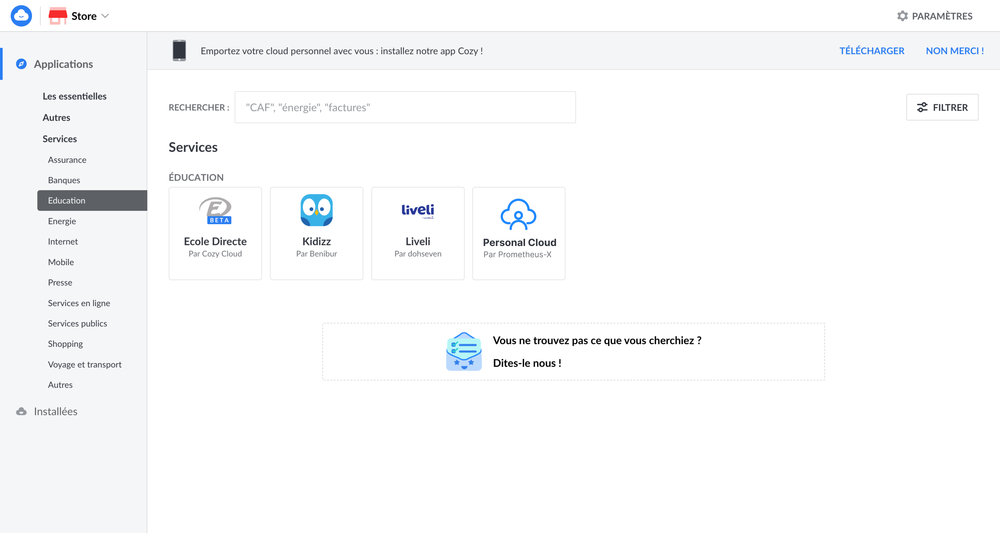
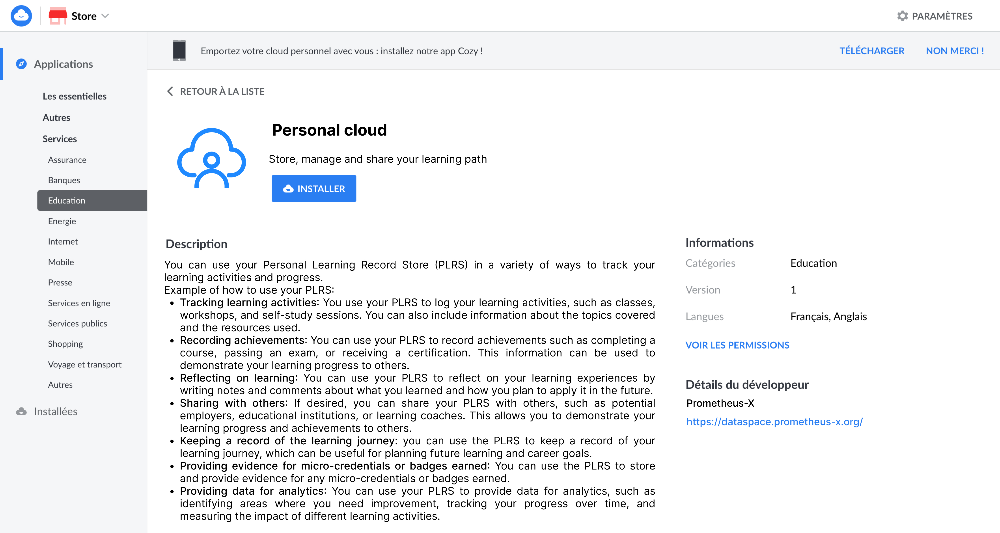
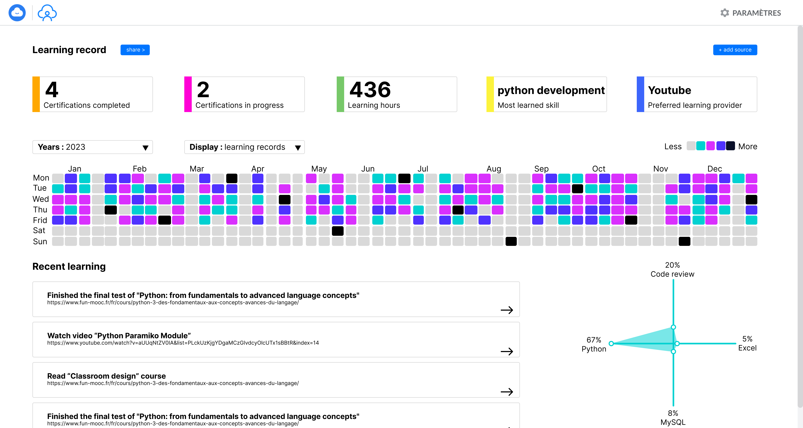
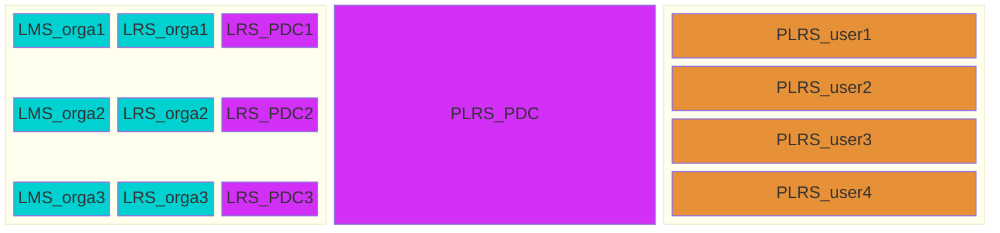
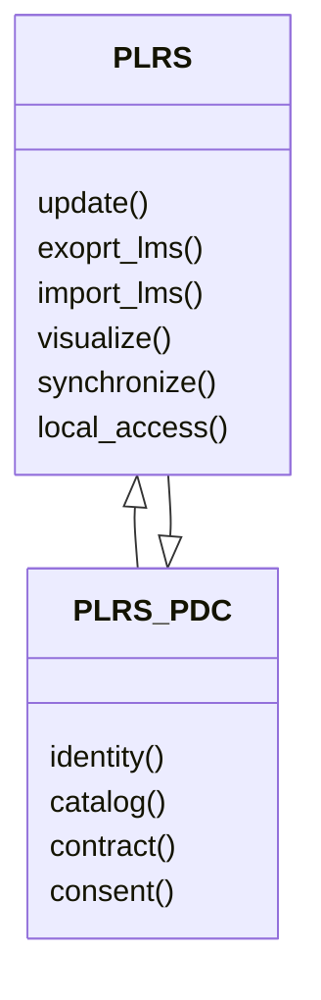
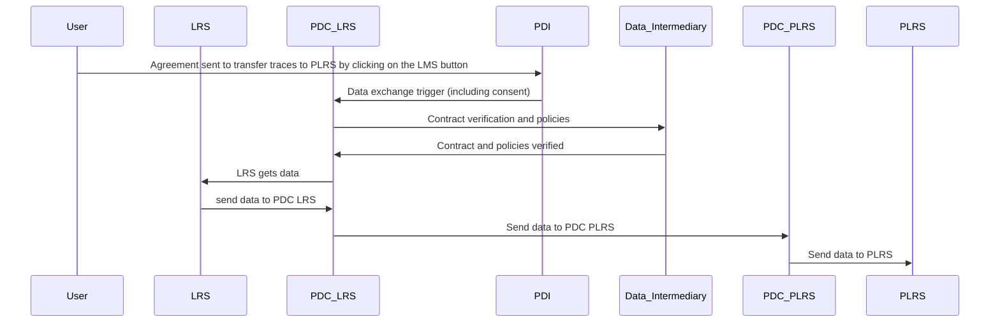
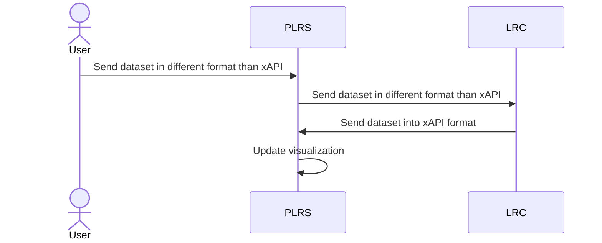
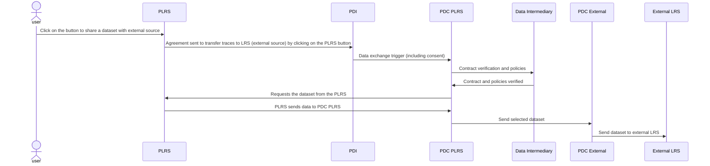
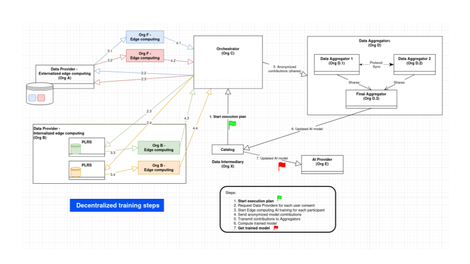

# Personal Learning Record Store (PLRS) BB – Design Document

Personal Learning Record Store (PLRS) service is a type of cloud-based service that allows individuals to store and manage their own learning records in a central location. A PLRS will allow individuals to easily access, download, and reuse their personal learning data, which is a key aspect of data portability under the GDPR. It also helps the data controller to comply with GDPR regulation. PLRS will allow individuals to keep track of their learning activities, achievements, and progress, and to share this information with others if, or when, they choose to.

While a typical [Learning Record Store (LRS)](https://github.com/adlnet/xAPI-Spec/blob/master/xAPI-About.md#part-one-about-the-experience-api) is owned by the organizations providing the training to the learner, a PLRS is owned directly by the learner itself.

A personal LRS can be considered as a "personal cloud" service, as it allows individuals to store and access their learning records from any device with internet access. It also provides a level of control, security and privacy as the data is owned and controlled by the individual. Personal LRS can also allow for greater interoperability with other systems or applications by providing a standardized way of storing and sharing learning records.

Please note that the following visuals are intended as projections only. UX/UI work will be carried out later in the process.








## Technical usage scenarios & Features

**Key functionalities:**

- reception of learning traces into the PLRS (action of an external source)

- import learning traces from LMS to PLRS (in PLRS frontend)

- visualize learning traces in PLRS

- synchronize PLRS data with external LRS (regular or ponctual push)

- local access to data for edge computing (feature available in second version)

**Value-added:**

- lifelong availability of my learning data (data retention for 80 years)

- better learning path/career analysis

- edge computing : improve AIs 

### Features/main functionalities

**Features**: 

- **Reception of learning traces into the PLRS (action of an external source)** 
An external source can send traces via API to the PLRS. The action comes from the external source. This may be a plugin on an LMS that triggers the sending of traces to the PLRS. Depending on the LMS, a gateway will be created. It can take the form of a button (PLRS does not develop this button in LMSs). When users click on it, they send their personal data to the PLRS. The plugin is not supported by PLRS.
Knowing that the PLRS only accepts xAPI format, if the data from the LMS does not have this format, the first call will be made to the LRC. 

- **Import learning traces from LMS to PLRS (in PLRS frontend)** 
If the LMS the learner is using doesn't have this direct export to PLRS button, then they can choose to export their dataset from the LMS and then import it into PLRS. 

- **Visualize learning traces in PLRS** 
The aim is not to have a complete visualization of learning traces. It just needs to display a limited amount of information in the dashboard, such as: number of traces per day, certification in progress, certification acquired, etc. (tbd). \
For a complete visualization, the PLRS can be connected to another application dedicated to this purpose. 

- **Synchronize PLRS data with external LRS** 
Students can permanently (or not) share their learning traces with an external LRS. Synchronization is a regular push operation. Whether it's to justify their progress to a school or to their employer, users are in control of their data. These data exchanges are in xAPI format. Regular tests will be performed and an error message will be sent if statements are not received.


- **Local access to data for decentralized AI training**  feature available in second version.
This makes it possible to run computation on the data locally (within the PLRS) and only return the result. This way learner data do not exit their PLRS and limit privacy issues associated with sharing data externally.

### Technical usage scenarios

A student can use their Personal Learning Record Store (PLRS) in a variety of ways to track their learning activities and progress. Here is an example of how a student might use their PLRS:

1. Tracking learning activities: The student can use their PLRS to log their learning activities, such as classes, workshops, and self-study sessions. They can also include information about the topics covered and the resources used.

2. Recording achievements: The student can use their PLRS to record achievements such as completing a course, passing an exam, or receiving a certification. This information can be used to demonstrate their learning progress to others.

3. Sharing with others: If desired, the student can share the learning data in their PLRS with others, such as potential employers, educational institutions, or learning coaches. This allows them to demonstrate their learning progress and achievements to others.

4. Keeping a record of the learning journey: The student can use the PLRS to keep a record of their learning journey, which can be useful for planning future learning and career goals.

5. Providing evidence for micro-credentials or badges earned: The student can use the PLRS to store and provide evidence for any micro-credentials or badges earned.

6. Providing data for analytics: The student can use their PLRS to provide data for analytics, such as identifying areas where they need improvement, tracking their progress over time, and measuring the impact of different learning activities.

The PLRS is beneficial for training organizations:

1. Ensure training progress: The student can share his or her credentials and progress on a permanent basis.

2. Detecting trouble spots: Thanks to sharing, the organization will have more learning traces, making it possible to detect learner difficulties, especially those recorded before the student joined the current training organization.

The PLRS is beneficial for future employers:

1. Check skills held: Locally shared traces enable the future employer to ascertain the skills of the individual. This can have a positive impact on the person's employment, as their skills are verified and not just a line on their CV.

2. Don't waste time on profiles that don't match: The future employer can easily detect whether the person's skills are in line with those required for a job. This way, the employer and the individual don't waste time when there's no match.

## Requirements

| Requirement ID | Short description | BB input format | BB output format | Any other constraints | Verified by scenario | Requirement type |
|---|---|---|---|---|---|---|
| BB-REQ_ID__1 | PLRS must request building block consent via the Prometheus-X Dataspace Connector | API call | API response |  |  |  |
| BB-REQ_ID__1.1 | Individuals must consent to the export, import, and use of their data in PLRS. | API call | API response | If the answer is no, the data cannot be used, nor transferred into or from the PLRS. If the answer is yer, the data can be used, and transferred into or from the PLRS. | BB-SC-PLRS-01 | FUN |
| BB-REQ_ID__1.2 | Consent must be asked and verified in less than 30s | API call | API response |  | BB-SC-PLRS-02 | PERF |
| BB-REQ_ID__2 | PLRS must request contracts from the building block contract via the Prometheus-X Dataspace Connector | API call | API response |  |  |  |
| BB-REQ_ID__2.1 | The PLRS must check with the contract manager through the Dataspace connector if a contract for the data provider or the data consumer (The LMS for functionality 1 and 2) | API call | API response | If the answer is no, the data cannot be accessed, nor transferred into or from the PLRS. If the answer is yer, the data can be accessed, and transferred into or from the PLRS. | BB-SC-PLRS-03 | DEP |
| BB-REQ_ID__2.2 | Contract must be asked and verified in less than 30s | API call | API response |  | BB-SC-PLRS-04 | PERF |
| BB-REQ_ID__3 | PLRS should connect with BB Decentralized AI training (EDGE-Skill) |  |  |  |  |  |
| BB-REQ_ID__3.1 | PLRS should be able to run algorithm shared by BB Decentralized AI training, locally on the data in the PLRS | API interaction | API interaction | Data transfer via xAPI. Could be asynchronous | BB-SC-PLRS-05 | FUN |
| BB-REQ_ID__3.2 | Running the algorithm must be done in less than 2 min (times TBD)| API call | API response |  | BB-SC-PLRS-06 | PERF |

## Integrations

### Direct Integrations with Other BBs

| Category                                    | Why?                                      | How?                                                                     |
|---------------------------------------------|-------------------------------------------|--------------------------------------------------------------------------|
| Interact with Decentralized AI training (future functionality)| train AI model| send anonymized (or not) data to train AI models                         |
| Interact with LRC  (future functionality)| Harmonize data in the PLRS in xAPI | Convert any dataset to xAPI format|


### Integrations via Connector

| Category                       | Why?                                                       | What?                                                                                                   |
|--------------------------------|------------------------------------------------------------|--------------------------------------------------------------------------------------------------------|
| Connection with connector      | Simplify communication between the PLRS and PTX CCs       |                                                                                                        |
| Connection with contract       | Contract between PLRS and the LMS authorizing export of user data | Obtain the organization's agreement to export user data.<br>Identify the data standard to be transferred. |
| Connection with consent        | User consent to export/import his data                    | Obtain the user's consent to export data.<br>Obtain consent to import data.<br>Obtain person's agreement to share data with selected organizations/persons.<br>Obtain the person's agreement to use his data to improve AI.<br>Obtain consent to analyze data. |
| Connection with identity       | Enable PLRS to use users' identities to display metadata with others | Use the user's first and last name.<br>Use the user's professional background.<br>Use the user's educational background. |


## Relevant Standards

### Data Format Standards

**Data format**

- The data produced and/or consumed are learning records. These are logs of learning activity done by a user.

- There are several standard formats for learning records (SCORM, xAPI, cmi5, IMS caliper)
  
- The consensus among experts is that xAPI is the most promising standard for describing learning records.

- Inokufu have published on Prometheus-X's github a state of the art study about learning records interoperability in 2023 (see [here](https://github.com/Prometheus-X-association/learning-records-interoperability-2023)). This study describes the various formats and explains why “we" have selected xAPI as the defacto format for learning records for DASES (Dataspace of Education & Skills).
    - In summary, xAPI have been chosen over SCORM, IMS Caliper, and cmi5 for its unparalleled flexibility and comprehensive data tracking capabilities.
    - While SCORM has served the e-learning community well, its limitations in handling offline learning, detailed data reporting, and informal learning experiences became apparent. SCORM’s inability to adapt to the rapidly evolving tech world, including mobile devices and cloud-based technologies, hindered its efficacy.
    - IMS Caliper, though robust in tracking web-based digital learning environments, falls short in its versatility compared to xAPI. xAPI can track a wide range of learning experiences across multiple platforms, including mobile, games, simulations, and offline interactions. This makes it a far more adaptable solution for modern learning environments.
    - Although cmi5 effectively bridges SCORM and xAPI by combining xAPI's tracking capabilities with SCORM's structured control, it still lacks the full flexibility provided by xAPI. Additionally, xAPI presents better compatibility conditions with different LMS and authoring tools compared to cmi5, thereby fostering greater interoperability within the data space.
    - The true strength of xAPI lies in its "extensions" attribute, allowing the capture of unique or granular details about any learning experience. This feature ensures that xAPI can be tailored to meet the specific needs of any organization, providing detailed and diverse data without being constrained by predefined parameters.
    - In essence, xAPI's ability to provide a shared data format that facilitates easy data transfer between systems while enabling highly relevant and specific tracking aspects makes it the optimal choice for our evolving educational needs.

- In xAPI, each learning record is a json statement. This json contains several parts: actor, verb, object, result, context, timestamp.

- The most critical personal data are in general in the actor part. According to xAPI, one can use first name, last name or email as the actor identifier. However, in our case we always recommend using uuid to identify actors. This way our learning records are pseudonymized by default. As this won’t always be the case with other organizations connected to the dataspace.

- If shared datasets are not in xAPI format, there is a BB ([Learning Records Converter](https://github.com/Prometheus-X-association/learning-records-converter)) that is part of the PTX dataspace that allows conversion to the chosen format for exchanges within the dataspace.

### Mapping to Data Space Reference Architecture Models



The blocks depicted in the architecture graphic represent hypothetical functions, as their development has not yet been completed. By prioritizing user control and consent, we aim to build trust and adhere to privacy regulations, ensuring users have a clear understanding and authority over their tracking preferences.

PDC : Prometheus-X Dataspace Connector

## Input / Output Data

In a Personal Learning Record Store (PLRS), the input and output processes revolve around the handling of xAPI statements, which are formatted as JSON files. The LRS serves as a repository for learning experiences and activities, capturing detailed data through these xAPI statements. These statements typically include information about the actor (learner), verb (action), and object (activity or resource), providing a standardized way to record and track learning interactions. 

The Personal Learning Record Store is designed to accommodate a wide range of learning traces, with the fundamental requirement being that they adhere to the xAPI format. Unlike systems that may require specific types of traces, our approach is more flexible, accepting any learning-related data as long as it is structured according to the xAPI specification. This inclusivity ensures that we capture a diverse array of learning activities, providing a comprehensive view of learner interactions and experiences. However, it's important to note that currently we do not have mechanisms in place to verify the authenticity of whether a trace is indeed in the xAPI format. This means that while we are open to receiving various types of learning data, ensuring its proper format relies on the accurate implementation of xAPI by data providers. The data sent can be a rating for an evaluation, a search, access to a page, etc. Each piece of information, no matter how small, is an indication of learning.

[More details on xAPI statement implementation](https://xapi.com/statements-101/)
[More details on xAPI statement in Cozy (doctype)](https://github.com/inokufu/cozy-doctypes/blob/docs/io.cozy.learningrecords/docs/io.cozy.learningrecords.md)

[Example of JSON file](https://github.com/Prometheus-X-association/plrs/blob/main/data/statements.json.gz)

Example of Becomino learning traces for an access : 
```json
{
  "stored": "2024-03-11T14:17:43.686Z",
  "priority": "MEDIUM",
  "active": true,
  "completedForwardingQueue": [],
  "failedForwardingLog": [],
  "client": "626a34fe1deb08f53ac12609",
  "lrs_id": "626a34fe1deb08d43dc12608",
  "completedQueues": [
    "STATEMENT_QUERYBUILDERCACHE_QUEUE",
    "STATEMENT_PERSON_QUEUE",
    "STATEMENT_FORWARDING_QUEUE"
  ],
  "activities": [
    "https://becomino.com/category/competences-bureautiques"
  ],
  "hash": "2b898680c9870ee54d8d260b75eb45d38fbb6c24",
  "agents": [
    "https://becomino.com/users|1710166580617x845375926584167200"
  ],
  "statement": {
    "authority": {
      "objectType": "Agent",
      "name": "Becomino",
      "mbox": "mailto:contact@becomino.com"
    },
    "stored": "2024-03-11T14:17:43.686Z",
    "context": {
      "contextActivities": {
        "parent": [
          {
            "id": "https://becomino.com/home",
            "objectType": "Activity"
          }
        ],
        "category": [
          {
            "id": "https://becomino.com/category/404",
            "objectType": "Activity"
          }
        ],
        "grouping": [
          {
            "id": "https://becomino.com/board/404",
            "objectType": "Activity"
          }
        ]
      },
      "language": "fr"
    },
    "actor": {
      "account": {
        "homePage": "https://becomino.com/users",
        "name": "1710166580617x845375926584167200"
      },
      "objectType": "Agent"
    },
    "timestamp": "2024-03-11T14:17:32.814Z",
    "version": "1.0.0",
    "id": "8f5e30f6-312e-4ec6-bc60-a37bcb1811ec",
    "verb": {
      "id": "https://w3id.org/xapi/netc/verbs/accessed",
      "display": {
        "en-US": "accessed"
      }
    },
    "object": {
      "id": "https://becomino.com/category/competences-bureautiques",
      "definition": {
        "name": {
          "fr": "Compétences bureautiques"
        },
        "description": {
          "fr": ""
        },
        "type": "http://adlnet.gov/expapi/activities/link"
      },
      "objectType": "Activity"
    }
  },
  "hasGeneratedId": true,
  "deadForwardingQueue": [],
  "voided": false,
  "verbs": [
    "https://w3id.org/xapi/netc/verbs/accessed"
  ],
  "personaIdentifier": "65ef1288fff35065a8f02d8c",
  "processingQueues": [],
  "person": {
    "_id": "65ef128899ffae0133166652",
    "display": "1710166580617x845375926584167200 - https://becomino.com/users (xAPI Account)"
  },
  "timestamp": "2024-03-11T14:17:32.814Z",
  "relatedActivities": [
    "https://becomino.com/category/competences-bureautiques",
    "https://becomino.com/home",
    "https://becomino.com/board/404",
    "https://becomino.com/category/404"
  ],
  "relatedAgents": [
    "https://becomino.com/users|1710166580617x845375926584167200",
    "mailto:contact@becomino.com"
  ],
  "organisation": "626a340cccbcc9000aff1421",
  "_id": "65ef1287c56582001cca4966",
  "registrations": [],
  "pendingForwardingQueue": []
}
```

Example of Becomino learning traces for an opening : 
```json
{
  "stored": "2024-03-11T14:03:53.853Z",
  "priority": "MEDIUM",
  "active": true,
  "completedForwardingQueue": [],
  "failedForwardingLog": [],
  "client": "626a34fe1deb08f53ac12609",
  "lrs_id": "626a34fe1deb08d43dc12608",
  "completedQueues": [
    "STATEMENT_QUERYBUILDERCACHE_QUEUE",
    "STATEMENT_PERSON_QUEUE",
    "STATEMENT_FORWARDING_QUEUE"
  ],
  "activities": [
    "https://www.youtube.com/watch?v=mBB_4io4t7w"
  ],
  "hash": "9c1dfe88035942439811946b7be0045c676b2de0",
  "agents": [
    "https://becomino.com/users|1710165537783x892345052938840600"
  ],
  "statement": {
    "authority": {
      "objectType": "Agent",
      "name": "Becomino",
      "mbox": "mailto:contact@becomino.com"
    },
    "stored": "2024-03-11T14:03:53.853Z",
    "context": {
      "contextActivities": {
        "parent": [
          {
            "id": "https://becomino.com/board/devenir-pro-immobilier-1638124052784x348049108536401000",
            "objectType": "Activity"
          }
        ],
        "category": [
          {
            "id": "https://becomino.com/category/vente",
            "objectType": "Activity"
          }
        ],
        "grouping": [
          {
            "id": "https://becomino.com/board/devenir-pro-immobilier",
            "objectType": "Activity"
          }
        ]
      },
      "language": "fr",
      "extensions": {
        "http://schema.inokufu.com/becomino/board": {
          "id": "https://becomino.com/board/devenir-pro-immobilier",
          "name": {
            "fr": "Devenir Pro en Transactions Immobilières"
          }
        }
      }
    },
    "actor": {
      "account": {
        "homePage": "https://becomino.com/users",
        "name": "1710165537783x892345052938840600"
      },
      "objectType": "Agent"
    },
    "timestamp": "2024-03-11T14:03:42.852Z",
    "version": "1.0.0",
    "id": "24215902-50d4-4a5a-8cf7-aa6df42ad394",
    "verb": {
      "id": "https://w3id.org/xapi/netc/verbs/opened",
      "display": {
        "en-US": "opened"
      }
    },
    "object": {
      "id": "https://www.youtube.com/watch?v=mBB_4io4t7w",
      "definition": {
        "name": {
          "fr": "Agent immobilier - Le métier"
        },
        "description": {
          "fr": "bonjour à tous je suis rom un quartier de la société romain quartier formation spécialisée en accompagnement et coaching immobilier j'ai conçu le test agent immobilier pour vous aider à prouver vos compétences et vous faire remarquer par des employeurs notre métier évolue enfin j'ai envie de vous di..."
        },
        "type": "http://adlnet.gov/expapi/activities/link",
        "extensions": {
          "http://schema.inokufu.com/learning-object/type": "Video",
          "http://schema.inokufu.com/learning-object/bloom": "discover",
          "http://schema.inokufu.com/learning-object/provider": "YouTube",
          "http://schema.inokufu.com/learning-object/picture": "https://i.ytimg.com/vi/mBB_4io4t7w/maxresdefault.jpg"
        }
      },
      "objectType": "Activity"
    }
  },
  "hasGeneratedId": true,
  "deadForwardingQueue": [],
  "voided": false,
  "verbs": [
    "https://w3id.org/xapi/netc/verbs/opened"
  ],
  "personaIdentifier": "65ef0e8cfff35065a8efaec2",
  "processingQueues": [],
  "person": {
    "_id": "65ef0e8c99ffaefc9516664e",
    "display": "1710165537783x892345052938840600 - https://becomino.com/users (xAPI Account)"
  },
  "__v": 1,
  "timestamp": "2024-03-11T14:03:42.852Z",
  "relatedActivities": [
    "https://www.youtube.com/watch?v=mBB_4io4t7w",
    "https://becomino.com/board/devenir-pro-immobilier-1638124052784x348049108536401000",
    "https://becomino.com/board/devenir-pro-immobilier",
    "https://becomino.com/category/vente"
  ],
  "relatedAgents": [
    "https://becomino.com/users|1710165537783x892345052938840600",
    "mailto:contact@becomino.com"
  ],
  "organisation": "626a340cccbcc9000aff1421",
  "_id": "65ef0f49c56582001cca4930",
  "registrations": [],
  "pendingForwardingQueue": []
}
```

Example of Becomino learning traces for a search : 
```json
{
  "stored": "2024-03-11T14:03:18.048Z",
  "priority": "MEDIUM",
  "active": true,
  "completedForwardingQueue": [],
  "failedForwardingLog": [],
  "client": "626a34fe1deb08f53ac12609",
  "lrs_id": "626a34fe1deb08d43dc12608",
  "completedQueues": [
    "STATEMENT_QUERYBUILDERCACHE_QUEUE",
    "STATEMENT_PERSON_QUEUE",
    "STATEMENT_FORWARDING_QUEUE"
  ],
  "activities": [
    "https://becomino.com/search/autocomplete%3Dvente"
  ],
  "hash": "c767c476e1ceec741589d207eb20c88a444f77a2",
  "agents": [
    "https://becomino.com/users|1710165537783x892345052938840600"
  ],
  "statement": {
    "authority": {
      "objectType": "Agent",
      "name": "Becomino",
      "mbox": "mailto:contact@becomino.com"
    },
    "stored": "2024-03-11T14:03:18.048Z",
    "context": {
      "contextActivities": {
        "parent": [
          {
            "id": "https://becomino.com/account",
            "objectType": "Activity"
          }
        ],
        "category": [
          {
            "id": "https://becomino.com/category/404",
            "objectType": "Activity"
          }
        ],
        "grouping": [
          {
            "id": "https://becomino.com/board/404",
            "objectType": "Activity"
          }
        ]
      },
      "language": "fr"
    },
    "actor": {
      "account": {
        "homePage": "https://becomino.com/users",
        "name": "1710165537783x892345052938840600"
      },
      "objectType": "Agent"
    },
    "timestamp": "2024-03-11T14:03:06.821Z",
    "version": "1.0.0",
    "id": "773aa025-fa60-4dab-97f7-515efdf1e2cb",
    "verb": {
      "id": "https://w3id.org/xapi/acrossx/verbs/searched",
      "display": {
        "en-US": "searched"
      }
    },
    "object": {
      "id": "https://becomino.com/search/autocomplete%3Dvente",
      "definition": {
        "name": {
          "fr": "autocomplete=vente"
        },
        "description": {
          "fr": ""
        }
      },
      "objectType": "Activity"
    }
  },
  "hasGeneratedId": true,
  "deadForwardingQueue": [],
  "voided": false,
  "verbs": [
    "https://w3id.org/xapi/acrossx/verbs/searched"
  ],
  "personaIdentifier": "65ef0e8cfff35065a8efaec2",
  "processingQueues": [],
  "person": {
    "_id": "65ef0e8c99ffaefc9516664e",
    "display": "1710165537783x892345052938840600 - https://becomino.com/users (xAPI Account)"
  },
  "__v": 1,
  "timestamp": "2024-03-11T14:03:06.821Z",
  "relatedActivities": [
    "https://becomino.com/search/autocomplete%3Dvente",
    "https://becomino.com/account",
    "https://becomino.com/board/404",
    "https://becomino.com/category/404"
  ],
  "relatedAgents": [
    "https://becomino.com/users|1710165537783x892345052938840600",
    "mailto:contact@becomino.com"
  ],
  "organisation": "626a340cccbcc9000aff1421",
  "_id": "65ef0f26c56582001cca4928",
  "registrations": [],
  "pendingForwardingQueue": []
}
```

## Architecture


PDC : Prometheus-X Dataspace Connector

## Dynamic Behaviour

Behavior when exporting a dataset from the LMS :

PDC : Prometheus-X Dataspace Connector

Behavior when importing a dataset from the PLRS (future fonctionality):


PDC : Prometheus-X Dataspace Connector

Behavior when share a dataset from the PLRS :

PDC : Prometheus-X Dataspace Connector

## Configuration and deployment settings

### Deployment & installation

- The user must have created its Cozy cloud and installed it on its device (see [here](https://cozy.io/en/download/))

- Once installed, the user must go to cozy app store and select the PLRS app

- The user links his PDI to his PLRS


### Error Scenarios Defined

The idea of the risk table is to define the probable causes of failure in order to estimate the probability of encountering this failure, to evaluate its secondary effects and therefore to plan preventive or corrective actions.


We will assign 3 scores on a scale of 1 to 10 to potential failures:

- **Detection** (risk of non-detection)

- **Occurrence** (probable occurrence, frequency of occurrence)

- **Severity of Effect** (consequences for the customer)


Criticality is calculated as follows:

`criticality = detection x occurrence x severity`


If criticality is greater than 10, then preventive action must be taken. If not, no action is required.


| ID  | Function involved                                  | Description of risk                                               | Effect of failure                                              | Cause of failure                                               | Evaluation              | Preventive actions                                                                 |
|-----|----------------------------------------------------|--------------------------------------------------------------------|-----------------------------------------------------------------|-----------------------------------------------------------------|-------------------------|------------------------------------------------------------------------------------|
| Error-Scenario_1   | export/import learning statements from LMS to PLRS | Data may be lost during migration| The student doesn't have his tracks in his PLRS| Incorrect connection between PLRS and LMS| Detection: 1 Occurrence: 2 Severity: 4 Criticality: 8||
| Error-Scenario_2   | export/import learning statements from LMS to PLRS | LMS statements are not in xAPI format| LMS and PLRS cannot communicate with each other| LMS-specific data format| Detection: 1 Occurrence: 4 Severity: 8 Criticality: 32| Setting up an LRC between LMS and PLRS |
| Error-Scenario_3   | export/import learning statements from LMS to PLRS | Data could be transmitted to other non-targeted LRSs| Exported data may be accessible to unauthorized persons| They are not properly secured| Detection: 6 Occurrence: 1 Severity: 9 Criticality: 54|Tracing output (PDC to PDC)|
| Error-Scenario_4   | export/import learning statements from LMS to PLRS | The same data can be exported several times| Wrong visualization and learning path| Duplicate data| Detection: 1 Occurrence: 6 Severity: 6 Criticality: 36| Have a program that detects duplicates|
| Error-Scenario_5   | export/import learning statements from LMS to PLRS | The PLRS doesn't have enough storage space for all statements| No more statement import/export  | Too little storage| Detection: 1 Occurrence: 3 Severity: 9 Criticality: 27| Test the cloud service's scalability|
| Error-Scenario_6   | export/import learning statements from LMS to PLRS | The system may require downtime for large imports/exports| Disrupting normal operations| Low-performance servers| Detection: 1 Occurrence: 3 Severity: 4 Criticality: 12|  Exponential dispatch call |
| Error-Scenario_7   | export/import learning statements from LMS to PLRS | Graphs don't update| Poor information on learning path| Slow update due to servers| Detection: 1 Occurrence: 2 Severity: 2 Criticality: 4||
| Error-Scenario_8   | export/import learning statements from LMS to PLRS | Poorly designed graphics| No use of the platform| Graphs are misleading| Detection: 4 Occurrence: 3 Severity: 8 Criticality: 96 |Conduct pre and post development workshops to ascertain user requirements |
| Error-Scenario_9   | export/import learning statements from LMS to PLRS | Wrong design choices: colors, shapes, ...| No use of the platform| Visual choices such as colors and graphics can subliminally influence the perception of data. Graphs are non-inclusive | Detection: 4 Occurrence: 2 Severity: 8 Criticality: 64|  Conduct pre and post development workshops to ascertain user requirements and use accessibility tools |
| Error-Scenario_10  | export/import learning statements from LMS to PLRS| Synchronization processes can consume a lot of resources| Disrupting normal operations| Impacting the performance of real-time LRS systems| Detection: 1 Occurrence: 3 Severity: 3 Criticality: 9||
| Error-Scenario_11  | synchronize PLRS data with external LRS (regular push) | The synchronization process can require downtime that affects system availability, especially when large quantities of data need to be synchronized. | Reconnecting the PLRS and the new LRS/LMS| Low-performance servers| Detection: 1 Occurrence: 2 Severity: 4 Criticality: 8||
| Error-Scenario_12  | synchronize PLRS data with external LRS (regular push) | The organization may decide to change its LRS/LMS| No learner monitoring of synchronization. No data transfer transparency | Change of LRS/LMS| Detection: 1 Occurrence: 2 Severity: 3 Criticality: 6| |
| Error-Scenario_13  | synchronize PLRS data with external LRS (regular push) | Make sure that synchronization has been successful| Distorted data| No documentation | Detection: 1 Occurrence: 2 Severity: 4 Criticality: 8| |
| Error-Scenario_14  | synchronize PLRS data with external LRS (regular push) | Errors in the synchronization process can lead to complete synchronization failures, requiring manual diagnosis and correction | Distorted data  | Errors in the synchronization| Detection: 7 Occurrence: 3 Severity: 7 Criticality: 147| Have an error message|

## Third Party Components & Licenses

External components and licenses:

- Cozy cloud, [open source](https://github.com/cozy/cozy-stack), [license ](https://github.com/cozy/cozy-stack?tab=AGPL-3.0-1-ov-file#readme)[GPLv3](https://github.com/cozy/cozy-stack?tab=AGPL-3.0-1-ov-file#readme)

## OpenAPI Specification

The curren version of the OpenAPI specification can be found here:

[Personal Learning Records Store BB - OpenAPI specification](https://github.com/Prometheus-X-association/plrs/blob/main/docs/features/openapi.json)

## Codebase : Mockup version

We have carried out a study on the development of LRS. We have several options:
- develop an LRS from A to Z
- use an open source LRS as a basis
As time is short and open source LRS are already well developed, we decided to go for this option.
The LRS selected is [Ralph](https://openfun.github.io/ralph/latest/features/api/), because the code is clean and matches the xAPI profiles. However, it does not pass all the compliance tests, and some routes are missing.
As a result, we are going to improve the Ralph LRS to make it compliant.

To get a functional understanding of this mockup and see some sample traces, go here : https://github.com/Prometheus-X-association/plrs/blob/main/docs/Images/PLRS%20-%20Mockup%20.pdf

To have a write access to the traces make a request on this mockup document : https://docs.google.com/document/d/14F-7Q9_LMLnUqvDx8EzAVrVWhLo93P5dHB3c3acYNRg/edit?usp=sharing
To have a read access to the traces make a request on this mockup document: https://docs.google.com/document/d/1lr1r_naA1FR77qQzOdxbiCH6SZsunFcqvHBJ2JPOlZI/edit?usp=sharing 

### PUT
description: Store a single statement as a single member of a set.

### POST
description: "Store a set of statements (or a single statement as a single member of a set).

### GET
description: Read a single xAPI Statement or multiple xAPI Statements.

[See API answers](https://openfun.github.io/ralph/latest/features/api/)

## Connexion with Prometheus-X

### Personal Data Intermediary
As the PLRS involves the exchange of personal data, we need to include the PDI in the usage flow.
When installing a PLRS, users must enter their PDI, or they will be redirected to the PDI account creation area.
On this page, they will be able to consent to the exchange of their data with target organizations.
In this PDI space, the user can also initiate data exchange by clicking on the “export data” button in the organization space (e.g. “export my data from the Prof en Poche LMS”).


### Prometheus-X Dataspace Connector
In order to manage PLRS (1 PLRS per user) with the PDC, we are going to install a single PDC to ensure secure data exchange between the various PLRS.

The PDC will contain cozy identifiers (e.g. https://laurianemarxer-home.mycozy.cloud) associated with PDI identifiers (e.g. 39e2462d-db9f-4d47-9786-b09e2bcc3f45).
With this information, the PDC sends the dataset to the corresponding data space.

## Test Specification


The Personal Learning Record Store tests ensure that:

- Functionality is efficient

- Potential risks are under control

- Users are satisfied


### Test Plan


The PLRS testing strategy will focus on ensuring the accuracy, reliability, and performance of its functionality. We will use a combination of unit testing, integration testing, and user interface testing. The test environment will reproduce conditions similar to those in production in order to accurately validate BB behavior. Acceptance criteria will be defined on the basis of user stories, functional requirements, and performance criteria.


### Methodology

Summary of test :
- Validate requirements and potential risks
- Manual/unit LRS test
- Manual usage scenario
- UX/UI test

### Validate requirements and potential risks
Tests to validate requirements and potential risks.

| Verified by scenario| Description | Prerequisites | Test | Status |
|---|---|---|---|---|
| BB-SC-PLRS-01 | Individuals must consent to the export, import, and use of their data in PLRS| The user has an account configured on the plrs. He has an account configured on the PDI. He does not consent to the use of his data. | Try to export/import the data without consent in the PDI  |  Not tested yet |
| BB-SC-PLRS-02 | Consent must be asked and verified in less than 30s | The user has an account configured on the plrs. He has an account configured on the PDI. | Counting exchange time | Not tested yet |
| BB-SC-PLRS-03 |The PLRS must check with the contract manager through the Dataspace connector if a contract for the data provider or the data consumer (The LMS for functionality 1 and 2) | The user has an account configured on the plrs. He has an account configured on the PDI.The organization from which the user wants to extract data has no contract with the Dapo-X use case.| try to provoke a data exchange without a contract | Not tested yet |
| BB-SC-PLRS-04 | Contract must be asked and verified in less than 30s | The user has an account configured on the plrs. He has an account configured on the PDI. The organization from which the user wants to extract data has a contract with the Dapo-X use case.|  Verfified time counting  | Not tested yet |
| BB-SC-PLRS-05 | PLRS should be able to run algorithm shared by BB Decentralized AI training, locally on the data in the PLRS || unit test  | Not tested yet |
| BB-SC-PLRS-06 | Running the algorithm must be done in less than 2 min (times TBD) | | Verfified time counting  | Not tested yet |
| Error-Scenario_2 |LMS statements are not in xAPI format| The user has an account configured on the plrs. He has an account configured on the PDI. The organization from which the user wants to extract data has a contract with the Dapo-X use case.|Send traces not in xAPI format| Not tested yet  |
| Error-Scenario_3 | Data could be transmitted to other non-targeted LRSs | The user has an account configured on the plrs. He has an account configured on the PDI. The organization from which the user wants to extract data has a contract with the Dapo-X use case. |  Check statement output   | Validate : error message  |
| Error-Scenario_4 | The same data can be exported several times | The user has an account configured on the plrs. He has an account configured on the PDI. The organization from which the user wants to extract data has a contract with the Dapo-X use case.|  Make sure that duplicates are only counted once on the graphs   | Not tested yet  |
| Error-Scenario_5 | The PLRS doesn't have enough storage space for all statements | The user has an account configured on the plrs| Check the storage of PLRS   | Not tested yet  |
| Error-Scenario_6 | The system may require downtime for large imports/exports | The user has an account configured on the plrs. He has an account configured on the PDI. The organization from which the user wants to extract data has a contract with the Dapo-X use case. |  Check the LRS for visible statements when we import/export a large file   | Not tested yet  |
| Error-Scenario_8 | Poorly designed graphics | The user has an account configured on the plrs. |  conduct quantitative and qualitative tests  | Not tested yet  |
| Error-Scenario_9 | Wrong design choices: colors, shapes, ...  | The user has an account configured on the plrs.|  conduct quantitative and qualitative tests  | Not tested yet  |
| Error-Scenario_14| Errors in the synchronization process can lead to complete synchronization failures, requiring manual diagnosis and correction | The user has an account configured on the plrs. He has an account configured on the PDI. The organization from which the user wants to extract data has a contract with the Dapo-X use case. |  Unit test   | Not tested yet  |

### Manual/unit LRS tests 
Each LRS function (API link between cozy cloud database and LRS provider/consumer)
[View all tests](https://github.com/Prometheus-X-association/plrs/tree/main/tests)

#### Authentication

The API server supports the following authentication methods:
- HTTP basic authentication
- OpenID Connect authentication
- CozyStack authentication via api key

Base scenario : The user sends a request on `GET /whoami`

For each method, the system tests that :
- if the request lacks valid authentication credentials, the server should return an `HTTP 401 Unauthorized` client error response
- if the request contains valid authentication credentials, the server should return an `HTTP 200 OK` successful response and corresponding user data

#### Statements

##### Fetch a single Statement or multiple Statements

Base scenario : The user sends a request on `GET /xAPI/statements/`

The system tests that : 
- given 2 users A and B, traces written by authority A can only be read by user A
- all filters are working as expected (get by statementId, agent, verb, activity, since timestamp, until timestamp)
- pagination is working as expected (in conjonction with the filters)
- the server reacts well if no statement is found
- the server reacts well if one or more query parameters are invalid

##### Store a single Statement with a given id

Base scenario :  The user sends a request `PUT /xAPI/statements/` to post statement as json data

The system tests that:
- given a valid statement, the statement is stored and can be fetched
- if missing, `timestamp` and `stored` property are automatically added  
- if the server receives a statement with a statementId that it already has a Statement for, it does not make any modification to the statement :
	- if the received statement and the stored statement are equivalent, it returns an `HTTP 204 No Content` response
	- else it returns an `HTTP 409 Conflict` response
- the server reacts well in case of database failure
- the user has the necessary authorizations to write a statement

##### Store a Statement or a set of Statements

Base scenario : The user sends a request `POST /xAPI/statements/` to one or multiple statements as json data

The system tests that:
- given a valid statement, the statement is stored and can be fetched
- given a list of one or multiple valid statements, the statements are stored and can be fetched
- if missing, `timestamp` and `stored` property are automatically added  
- if the server receives one or multiple statements with a statementId that it already has a Statement for, it does not make any modification to the corresponding statements : 
	- if the received statements and the stored statements are equivalent, it stores all non existing statements
	- else it returns an `HTTP 409 Conflict` response
- the server reacts well in case of database failure
- the user has the necessary authorizations to write a statement


### Manual Scenario

Using the personas, user stories, user flow, and data flow from the DAPO-X use case, we established several test scenarios.
For the tests, we decided to use an inokufu learning platform Constellation. He owns it, so we will be able to see the results on the LRS.

**User triggers in Constellation the transfer of their data from Constellation to PLRS. It is a one time transfer.**

- The learner completes the "Test d'entrée en formation" activity on Constellation
    - https://constellation.inokufu.com/mod/quiz/view.php?id=374
    - It scores 6/10

- He obtains the certificate of completion
    - https://constellation.inokufu.com/course/view.php?id=25

- He finishes the "Introduction aux Data Spaces" course

- He exports his data to his PLRS (in LMS frontend)

Validation : This scenario is validated if the PLRS display statements of learning. In particular these 3 statements :
- The student completed the "Test d'entrée en formation" with 6/10.
- The student graded the certificate.
- The student completed the "Introduction aux data spaces" course.

**User triggers in PLRS the transfer of their data from Constellation to PLRS. It is a one time transfer**
- The learner completes the "Quizz de renforcement Prompt" activity on Constellation
    - https://constellation.inokufu.com/mod/hvp/view.php?id=29
    - It scores 7/10
    
- He transfers his data from LMS to his PLRS (in PLRS frontend)

Validation : This scenario is validated if the PLRS shows statements of learning. In particular this statement :
- The student completed the "Quizz de renforcement Prompt" with 7/10.

**User triggers in PLRS the transfer of their data from Constellation to PLRS. It is a regular transfer (every week)**
- The learner completes the activity "Lombricomposter"
    - Date: 01.10.2024
    - https://constellation.inokufu.com/mod/hvp/view.php?id=119

- The learner completes the course "Apprendre à composter en maison ou appartement"
    - Date: 02.10.2024
    - https://constellation.inokufu.com/course/view.php?id=9

- The learner completes the course “Sécurité incendie” 
- Obtain the certificate
    - Date: 06.10.2024
    - https://constellation.inokufu.com/course/view.php?id=12

Validation : This scenario is validated if the PLRS shows statements of learning. In particular these 5 statements in these dates (if the transfer is all saturday):
05.10.2024
- The student completed the "Lombricomposter" activity.
- The student graded the certificate.
- The student completed the "Apprendre à composter en maison ou appartement" course.
12.10.2024
- The student graded the certificate.
- The student completed the "Sécurité incendie" course.

**User triggers in PLRS the transfer of their data from PLRS to external app. It is a one time transfer.**
- The learner completes the course “Constellation, un atout pédagogique?”
    - Date: 04.07.2024
    - https://constellation.inokufu.com/course/view.php?id=8

- The learner completes the course “Sécurité incendie”
- He obtain the certificate
    - Date: 11.07.2024
    - https://constellation.inokufu.com/course/view.php?id=12
 
- He exports his data to the school's LRS (https://XXX.com/data/xAPIx), in PLRS frontend.

Validation : This scenario is validated if the school's LRS display statements of learning.

**User triggers in PLRS the transfer of their data from PLRS to external app. It is a regular transfer (every week).**
The user has given access to his data to the school's LRS (https://XXX.com/data/xAPIx)

- The learner completes the course “Constellation, un atout pédagogique?”
    - Date: 04.07.2024
    - https://constellation.inokufu.com/course/view.php?id=8

- The learner completes the course “Sécurité incendie”
- He obtain the certificate
    - Date: 11.07.2024
    - https://constellation.inokufu.com/course/view.php?id=12

Validation : This scenario is validated if the school's LRS display statements of learning.


### UX/UI test (where relevant)

Please note that the following visuals are intended as projections only. UX/UI work will be carried out later in the process.


## Partners & roles
[Inokufu](https://www.inokufu.com/) (BB leader): 
- Organize workshops
- Monitor partner progress
- Develop backend of PLRS

[Cozy cloud](https://cozy.io/en/): 
- Host infrastructure
- Develop frontend/application of PLRS
- Deploy PTX dataspace connector for PLRS

## Usage in the dataspace
The PLRS will be used in the service chain :
- Personal learning record: Sharing LMS/Moodle Data for Visualization
  
.png)
PDC : Prometheus-X Dataspace Connector

- Decentralized AI training: Training of trustworthy AI models
  
