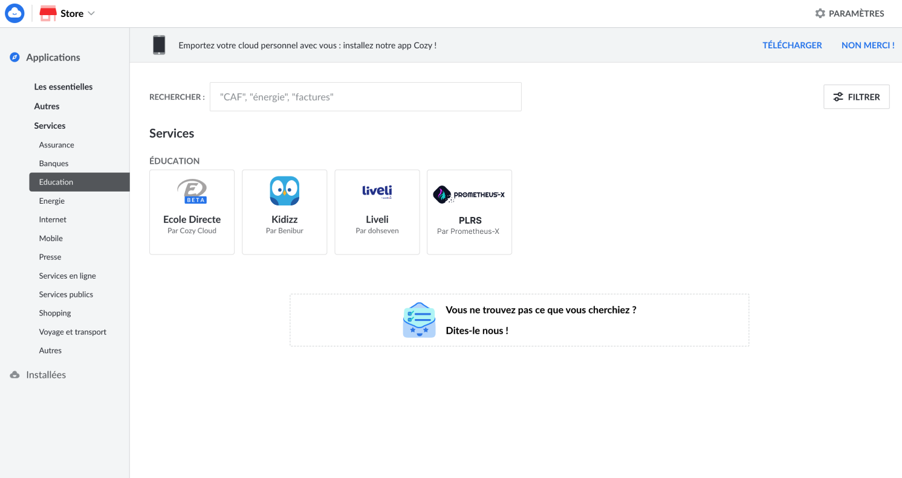

# Personal Learning Record Store (PLRS) BB – Design Document

Personal Learning Record Store (PLRS) service is a type of cloud-based service that allows individuals to store and manage their own learning records in a central location. A PLRS will allow individuals to easily access, download, and reuse their personal learning data, which is a key aspect of data portability under the GDPR. It also helps the data controller to comply with GDPR regulation. PLRS will allow individuals to keep track of their learning activities, achievements, and progress, and to share this information with others if, or when, they choose to.

While a typical [Learning Record Store (LRS)](https://github.com/adlnet/xAPI-Spec/blob/master/xAPI-About.md#part-one-about-the-experience-api) is owned by the organizations providing the training to the learner, a PLRS is owned directly by the learner itself.

A personal LRS can be considered as a "personal cloud" service, as it allows individuals to store and access their learning records from any device with internet access. It also provides a level of control, security and privacy as the data is owned and controlled by the individual. Personal LRS can also allow for greater interoperability with other systems or applications by providing a standardized way of storing and sharing learning records.

Please note that the following visuals are intended as projections only. UX/UI work will be carried out later in the process.




## Technical usage scenarios & Features

**Key functionalities:**

- export learning traces from LMS to PLRS (in LMS frontend)

- import learning traces from LMS to PLRS (in PLRS frontend)

- visualize learning traces in PLRS

- synchronize PLRS data with external LRS (regular push)

- local access to data for edge computing

**Value-added:**

- lifelong availability of my learning data

- better learning path/career analysis

- edge computing

### Features/main functionalities

**Features**: 

- **Export learning traces from LMS to PLRS (in LMS frontend)** 
Depending on the LMS, a gateway will be created. It can take the form of a button. When users click on it, they send their personal data to the PLRS. 
Knowing that the PLRS only accepts xAPI format, if the data from the LMS does not have this format, the first call will be made to the LRC. Path: 
    - "learner completes an activity on an LMS "
    - "its learning records are stored in the associated LRS"
    - "The user is asked about the terms of use and export of those learning records."
    - "The user accepts them"
    - "learning records are exported to PLRS by clicking a button"
    - "BB Consent checked for learner consent"
    - "BB Data veracity assurance ensures data consistency"
    - "LRC converts traces into xAPI"
    - "LRC sends traces to PLRS"
    - "Update of PLRS visual graphs and data"

- **Import learning traces from LMS to PLRS (in PLRS frontend)** 
If the LMS the learner is using doesn't have this direct export to PLRS button, then they can choose to export their dataset from the LMS and then import it into PLRS. Path:
  - "the learner adds a source in the PLRS: import dataset in any format"
  - "The user is asked about the terms of use and import of those learning records."
  - "The user accepts them"
  - "BB Consent checked for learner consent"
  - "BB Data veracity assurance ensures data consistency"
  - "LRC converts traces into xAPI"
  - "LRC sends traces to PLRS"
  - "adaptation of PLRS visual graphs and data"

- **Visualize learning traces in PLRS** 
The aim is not to have a complete visualization of learning traces. It just needs to display a limited amount of information in the dashboard, such as: number of traces per day, certification in progress, certification acquired, etc. (tbd). \
For a complete visualization, the PLRS can be connected to another application dedicated to this purpose. Path:
  - "learners can view indicators and graphs linked to their learning traces"

- **Synchronize PLRS data with external LRS** 
Students can permanently (or not) share their learning traces with an external LRS. Synchronization is a regular push operation. Whether it's to justify their progress to a school or to their employer, users are in control of their data. These data exchanges are in xAPI format. Path:  
  - "In the PLRS frontend, the learner selects the data he wants to share with the chosen external LRS."
  - "PLRS synchronizes with target LRS"

- **Local access to data for decentralized AI training** 
Users can give local access to their data to train model on them using a decentralized AI training approach.. This makes it possible to run computation on the data locally (within the PLRS) and only return the result. This way learner data do not exit their PLRS and limit privacy issues associated with sharing data externally. Path: 
  - "In the PLRS frontend, learner selects the data he wants to give local access to run an algorithm on it"
  - "PLRS runs locally the computation on the selected data"
  - "PLRS sends the result of the computation back to the edge computing orchestrator"

### Technical usage scenarios

A student can use their Personal Learning Record Store (PLRS) in a variety of ways to track their learning activities and progress. Here is an example of how a student might use their PLRS:

1. Tracking learning activities: The student can use their PLRS to log their learning activities, such as classes, workshops, and self-study sessions. They can also include information about the topics covered and the resources used.

2. Recording achievements: The student can use their PLRS to record achievements such as completing a course, passing an exam, or receiving a certification. This information can be used to demonstrate their learning progress to others.

3. Sharing with others: If desired, the student can share the learning data in their PLRS with others, such as potential employers, educational institutions, or learning coaches. This allows them to demonstrate their learning progress and achievements to others.

4. Keeping a record of the learning journey: The student can use the PLRS to keep a record of their learning journey, which can be useful for planning future learning and career goals.

5. Providing evidence for micro-credentials or badges earned: The student can use the PLRS to store and provide evidence for any micro-credentials or badges earned.

6. Providing data for analytics: The student can use their PLRS to provide data for analytics, such as identifying areas where they need improvement, tracking their progress over time, and measuring the impact of different learning activities.

The PLRS is beneficial for training organizations:

1. Ensure training progress: The student can share his or her credentials and progress on a permanent basis.

2. Detecting trouble spots: Thanks to sharing, the organization will have more learning traces, making it possible to detect learner difficulties, especially those recorded before the student joined the current training organization.

The PLRS is beneficial for future employers:

1. Check skills held: Locally shared traces enable the future employer to ascertain the skills of the individual. This can have a positive impact on the person's employment, as their skills are verified and not just a line on their CV.

2. Don't waste time on profiles that don't match: The future employer can easily detect whether the person's skills are in line with those required for a job. This way, the employer and the individual don't waste time when there's no match.

## Requirements

| Requirement ID | Short description | BB input format | BB output format | Any other constraints | Verified by scenario | Requirement type |
|---|---|---|---|---|---|---|
| BB-REQ_ID__1 | PLRS must request building block consent via the Prometheus-X Dataspace Connector | API call | API response |  |  |  |
| BB-REQ_ID__1.1 | Individuals must consent to the export, import, and use of their data in PLRS. | API call | API response | If the answer is no, the data cannot be used, nor transferred into or from the PLRS. If the answer is yer, the data can be used, and transferred into or from the PLRS. | BB-SC-PLRS-01 | DEP |
| BB-REQ_ID__1.2 | Consent must be asked and verified in less than 30s | API call | API response |  | BB-SC-PLRS-02 | PERF |
| BB-REQ_ID__2 | PLRS must request contracts from the building block consent via the Prometheus-X Dataspace Connector | API call | API response |  |  |  |
| BB-REQ_ID__2.1 | The PLRS must check with the contract manager through the Dataspace connector if a contract for the corresponding organization exists | API call | API response | If the answer is no, the data cannot be accessed, nor transferred into or from the PLRS. If the answer is yer, the data can be accessed, and transferred into or from the PLRS. | BB-SC-PLRS-03 | DEP |
| BB-REQ_ID__2.2 | Contract must be asked and verified in less than 30s | API call | API response |  | BB-SC-PLRS-04 | PERF |
| BB-REQ_ID__3 | PLRS must connect with BB Consent/contracts negotiating agent (EDGE-Skill) |  |  |  |  |  |
| BB-REQ_ID__3.1 | BB must send the individual's consent profile when the PLRS asks to adjust what and when they are tracked: all-time connection, only on weekends, certain keywords, etc. | API call | consent profile | Request consent 1 time, then update if the profile is modified in the corresponding building bloc. Could be asynchronous | BB-SC-PLRS-05 | DEP |
| BB-REQ_ID__3.2 | BB must update the individual's consent profile to PLRS when there are changes | consent profile | / | update if the profile is modified in the corresponding building bloc. Could be asynchronous | BB-SC-PLRS-06 | DEP |
| BB-REQ_ID__4 | PLRS should connect with BB Data veracity assurance (EDGE-Skill) | API call | API response |  |  |  |
| BB-REQ_ID__4.1 | BB Data veracity assurance should check dataset homogeneity and detail | xAPI (DASES) dataset | response |  | BB-SC-PLRS-07 | FUN |
| BB-REQ_ID__5 | PLRS should connect with BB Decentralized AI training (EDGE-Skill) |  |  |  |  |  |
| BB-REQ_ID__5.1 | PLRS should be able to run algorithm shared by BB Decentralized AI training, locally on the data in the PLRS | API interaction | API interaction | Data transfer via xAPI. Could be asynchronous | BB-SC-PLRS-08 | FUN |
| BB-REQ_ID__5.2 | Running the algorithm must be done in less than 2 min | API call | API response |  | BB-SC-PLRS-09 | PERF |

## Integrations

### Direct Integrations with Other BBs

**Interact with Decentralized AI training**

How?

- send anonymized (or not) data to train AI models

Why?

- train AI model

**Interact with Data veracity assurance**

How?

- Send access to dataset

Why?

- Ensure that data exploitation is feasible

- Ensure data consistency

**Interact with consent/contract**

How?

- Identify data import period (date, time, week)

- Identify data export period (date, time, week, organization)

Why?

- Transparency on data transfer

**Interact with Distributed data visualization**

How?

- Send dataset in xAPI format

- Asynchronous

Why?

- Visualize the learner's skills

### Integrations via Connector

**Connection with connector**

Why?

- Simplify communication between the PLRS and PTX CCs

**Connection with contract**

Why?

- Contract between PLRS and the LMS authorizing export of user data

What?

- Obtain the organization's agreement to export user data.

- Identify the data standard to be transferred.

**Connection with consent**

Why?

- User consent to export/import his data

What?

- Obtain the user's consent to export data

- Obtain consent to import data

- Obtain person's agreement to share data with selected organizations/persons

- Obtain the person's agreement to use his data to improve AI

- Obtain consent to analyze data

**Connection with identity**

Why?

- Enable PLRS to use users' identities to display metadata with other

What?

- Use the user's first and last name

- Use the user's professional background

- Use the user's educational background

**Connection with LRC**

Why?

- Harmonize data in the PLRS in xAPI

What?

- Convert any dataset to xAPI format

## Relevant Standards

### Data Format Standards

**Data format**

- The data produced and/or consumed are learning records. These are logs of learning activity done by a user.

- There are several standard formats for learning records (SCORM, xAPI, cmi5, IMS caliper).

- The consensus among experts is that xAPI is the most promising standard for describing learning records.

- Inokufu have published on Prometheus-X's github a state of the art study about learning records interoperability in 2023 (see [here](https://github.com/Prometheus-X-association/learning-records-interoperability-2023)). This study describes the various formats and explains why “we" have selected xAPI as the defacto format for learning records for DASES (Dataspace of Education & Skills).

- In xAPI, each learning record is a json statement. This json contains several parts: actor, verb, object, result, context, timestamp.

- The most critical personal data are in general in the actor part. According to xAPI, one can use first name, last name or email as the actor identifier. However, in our case we always recommend using uuid to identify actors. This way our learning records are pseudonymized by default. As this won’t always be the case with other organizations connected to the dataspace.

- If shared datasets are not in xAPI format, LRC must be used to convert them to the correct format.

### Mapping to Data Space Reference Architecture Models


PDC : Prometheus-X Dataspace Connector

## Input / Output Data

Input and output data are in the same format: xAPI.

Example of Becomino learning traces for an access : 
```json
{
  "stored": "2024-03-11T14:17:43.686Z",
  "priority": "MEDIUM",
  "active": true,
  "completedForwardingQueue": [],
  "failedForwardingLog": [],
  "client": "626a34fe1deb08f53ac12609",
  "lrs_id": "626a34fe1deb08d43dc12608",
  "completedQueues": [
    "STATEMENT_QUERYBUILDERCACHE_QUEUE",
    "STATEMENT_PERSON_QUEUE",
    "STATEMENT_FORWARDING_QUEUE"
  ],
  "activities": [
    "https://becomino.com/category/competences-bureautiques"
  ],
  "hash": "2b898680c9870ee54d8d260b75eb45d38fbb6c24",
  "agents": [
    "https://becomino.com/users|1710166580617x845375926584167200"
  ],
  "statement": {
    "authority": {
      "objectType": "Agent",
      "name": "Becomino",
      "mbox": "mailto:contact@becomino.com"
    },
    "stored": "2024-03-11T14:17:43.686Z",
    "context": {
      "contextActivities": {
        "parent": [
          {
            "id": "https://becomino.com/home",
            "objectType": "Activity"
          }
        ],
        "category": [
          {
            "id": "https://becomino.com/category/404",
            "objectType": "Activity"
          }
        ],
        "grouping": [
          {
            "id": "https://becomino.com/board/404",
            "objectType": "Activity"
          }
        ]
      },
      "language": "fr"
    },
    "actor": {
      "account": {
        "homePage": "https://becomino.com/users",
        "name": "1710166580617x845375926584167200"
      },
      "objectType": "Agent"
    },
    "timestamp": "2024-03-11T14:17:32.814Z",
    "version": "1.0.0",
    "id": "8f5e30f6-312e-4ec6-bc60-a37bcb1811ec",
    "verb": {
      "id": "https://w3id.org/xapi/netc/verbs/accessed",
      "display": {
        "en-US": "accessed"
      }
    },
    "object": {
      "id": "https://becomino.com/category/competences-bureautiques",
      "definition": {
        "name": {
          "fr": "Compétences bureautiques"
        },
        "description": {
          "fr": ""
        },
        "type": "http://adlnet.gov/expapi/activities/link"
      },
      "objectType": "Activity"
    }
  },
  "hasGeneratedId": true,
  "deadForwardingQueue": [],
  "voided": false,
  "verbs": [
    "https://w3id.org/xapi/netc/verbs/accessed"
  ],
  "personaIdentifier": "65ef1288fff35065a8f02d8c",
  "processingQueues": [],
  "person": {
    "_id": "65ef128899ffae0133166652",
    "display": "1710166580617x845375926584167200 - https://becomino.com/users (xAPI Account)"
  },
  "timestamp": "2024-03-11T14:17:32.814Z",
  "relatedActivities": [
    "https://becomino.com/category/competences-bureautiques",
    "https://becomino.com/home",
    "https://becomino.com/board/404",
    "https://becomino.com/category/404"
  ],
  "relatedAgents": [
    "https://becomino.com/users|1710166580617x845375926584167200",
    "mailto:contact@becomino.com"
  ],
  "organisation": "626a340cccbcc9000aff1421",
  "_id": "65ef1287c56582001cca4966",
  "registrations": [],
  "pendingForwardingQueue": []
}
```

Example of Becomino learning traces for an opening : 
```json
{
  "stored": "2024-03-11T14:03:53.853Z",
  "priority": "MEDIUM",
  "active": true,
  "completedForwardingQueue": [],
  "failedForwardingLog": [],
  "client": "626a34fe1deb08f53ac12609",
  "lrs_id": "626a34fe1deb08d43dc12608",
  "completedQueues": [
    "STATEMENT_QUERYBUILDERCACHE_QUEUE",
    "STATEMENT_PERSON_QUEUE",
    "STATEMENT_FORWARDING_QUEUE"
  ],
  "activities": [
    "https://www.youtube.com/watch?v=mBB_4io4t7w"
  ],
  "hash": "9c1dfe88035942439811946b7be0045c676b2de0",
  "agents": [
    "https://becomino.com/users|1710165537783x892345052938840600"
  ],
  "statement": {
    "authority": {
      "objectType": "Agent",
      "name": "Becomino",
      "mbox": "mailto:contact@becomino.com"
    },
    "stored": "2024-03-11T14:03:53.853Z",
    "context": {
      "contextActivities": {
        "parent": [
          {
            "id": "https://becomino.com/board/devenir-pro-immobilier-1638124052784x348049108536401000",
            "objectType": "Activity"
          }
        ],
        "category": [
          {
            "id": "https://becomino.com/category/vente",
            "objectType": "Activity"
          }
        ],
        "grouping": [
          {
            "id": "https://becomino.com/board/devenir-pro-immobilier",
            "objectType": "Activity"
          }
        ]
      },
      "language": "fr",
      "extensions": {
        "http://schema.inokufu.com/becomino/board": {
          "id": "https://becomino.com/board/devenir-pro-immobilier",
          "name": {
            "fr": "Devenir Pro en Transactions Immobilières"
          }
        }
      }
    },
    "actor": {
      "account": {
        "homePage": "https://becomino.com/users",
        "name": "1710165537783x892345052938840600"
      },
      "objectType": "Agent"
    },
    "timestamp": "2024-03-11T14:03:42.852Z",
    "version": "1.0.0",
    "id": "24215902-50d4-4a5a-8cf7-aa6df42ad394",
    "verb": {
      "id": "https://w3id.org/xapi/netc/verbs/opened",
      "display": {
        "en-US": "opened"
      }
    },
    "object": {
      "id": "https://www.youtube.com/watch?v=mBB_4io4t7w",
      "definition": {
        "name": {
          "fr": "Agent immobilier - Le métier"
        },
        "description": {
          "fr": "bonjour à tous je suis rom un quartier de la société romain quartier formation spécialisée en accompagnement et coaching immobilier j'ai conçu le test agent immobilier pour vous aider à prouver vos compétences et vous faire remarquer par des employeurs notre métier évolue enfin j'ai envie de vous di..."
        },
        "type": "http://adlnet.gov/expapi/activities/link",
        "extensions": {
          "http://schema.inokufu.com/learning-object/type": "Video",
          "http://schema.inokufu.com/learning-object/bloom": "discover",
          "http://schema.inokufu.com/learning-object/provider": "YouTube",
          "http://schema.inokufu.com/learning-object/picture": "https://i.ytimg.com/vi/mBB_4io4t7w/maxresdefault.jpg"
        }
      },
      "objectType": "Activity"
    }
  },
  "hasGeneratedId": true,
  "deadForwardingQueue": [],
  "voided": false,
  "verbs": [
    "https://w3id.org/xapi/netc/verbs/opened"
  ],
  "personaIdentifier": "65ef0e8cfff35065a8efaec2",
  "processingQueues": [],
  "person": {
    "_id": "65ef0e8c99ffaefc9516664e",
    "display": "1710165537783x892345052938840600 - https://becomino.com/users (xAPI Account)"
  },
  "__v": 1,
  "timestamp": "2024-03-11T14:03:42.852Z",
  "relatedActivities": [
    "https://www.youtube.com/watch?v=mBB_4io4t7w",
    "https://becomino.com/board/devenir-pro-immobilier-1638124052784x348049108536401000",
    "https://becomino.com/board/devenir-pro-immobilier",
    "https://becomino.com/category/vente"
  ],
  "relatedAgents": [
    "https://becomino.com/users|1710165537783x892345052938840600",
    "mailto:contact@becomino.com"
  ],
  "organisation": "626a340cccbcc9000aff1421",
  "_id": "65ef0f49c56582001cca4930",
  "registrations": [],
  "pendingForwardingQueue": []
}
```

Example of Becomino learning traces for a search : 
```json
{
  "stored": "2024-03-11T14:03:18.048Z",
  "priority": "MEDIUM",
  "active": true,
  "completedForwardingQueue": [],
  "failedForwardingLog": [],
  "client": "626a34fe1deb08f53ac12609",
  "lrs_id": "626a34fe1deb08d43dc12608",
  "completedQueues": [
    "STATEMENT_QUERYBUILDERCACHE_QUEUE",
    "STATEMENT_PERSON_QUEUE",
    "STATEMENT_FORWARDING_QUEUE"
  ],
  "activities": [
    "https://becomino.com/search/autocomplete%3Dvente"
  ],
  "hash": "c767c476e1ceec741589d207eb20c88a444f77a2",
  "agents": [
    "https://becomino.com/users|1710165537783x892345052938840600"
  ],
  "statement": {
    "authority": {
      "objectType": "Agent",
      "name": "Becomino",
      "mbox": "mailto:contact@becomino.com"
    },
    "stored": "2024-03-11T14:03:18.048Z",
    "context": {
      "contextActivities": {
        "parent": [
          {
            "id": "https://becomino.com/account",
            "objectType": "Activity"
          }
        ],
        "category": [
          {
            "id": "https://becomino.com/category/404",
            "objectType": "Activity"
          }
        ],
        "grouping": [
          {
            "id": "https://becomino.com/board/404",
            "objectType": "Activity"
          }
        ]
      },
      "language": "fr"
    },
    "actor": {
      "account": {
        "homePage": "https://becomino.com/users",
        "name": "1710165537783x892345052938840600"
      },
      "objectType": "Agent"
    },
    "timestamp": "2024-03-11T14:03:06.821Z",
    "version": "1.0.0",
    "id": "773aa025-fa60-4dab-97f7-515efdf1e2cb",
    "verb": {
      "id": "https://w3id.org/xapi/acrossx/verbs/searched",
      "display": {
        "en-US": "searched"
      }
    },
    "object": {
      "id": "https://becomino.com/search/autocomplete%3Dvente",
      "definition": {
        "name": {
          "fr": "autocomplete=vente"
        },
        "description": {
          "fr": ""
        }
      },
      "objectType": "Activity"
    }
  },
  "hasGeneratedId": true,
  "deadForwardingQueue": [],
  "voided": false,
  "verbs": [
    "https://w3id.org/xapi/acrossx/verbs/searched"
  ],
  "personaIdentifier": "65ef0e8cfff35065a8efaec2",
  "processingQueues": [],
  "person": {
    "_id": "65ef0e8c99ffaefc9516664e",
    "display": "1710165537783x892345052938840600 - https://becomino.com/users (xAPI Account)"
  },
  "__v": 1,
  "timestamp": "2024-03-11T14:03:06.821Z",
  "relatedActivities": [
    "https://becomino.com/search/autocomplete%3Dvente",
    "https://becomino.com/account",
    "https://becomino.com/board/404",
    "https://becomino.com/category/404"
  ],
  "relatedAgents": [
    "https://becomino.com/users|1710165537783x892345052938840600",
    "mailto:contact@becomino.com"
  ],
  "organisation": "626a340cccbcc9000aff1421",
  "_id": "65ef0f26c56582001cca4928",
  "registrations": [],
  "pendingForwardingQueue": []
}
```

## Architecture


PDC : Prometheus-X Dataspace Connector

## Dynamic Behaviour

Behavior when exporting a dataset from the LMS :

PDC : Prometheus-X Dataspace Connector

Behavior when importing a dataset from the PLRS :


PDC : Prometheus-X Dataspace Connector

Behavior when share a dataset from the PLRS :

PDC : Prometheus-X Dataspace Connector

## Configuration and deployment settings

Deployment & installation

- The user must have created its Cozy cloud and installed it on its device (see [here](https://cozy.io/en/download/))

- Once installed, the user must go to cozy app store and select the PLRS app

## Third Party Components & Licenses

External components and licenses:

- Cozy cloud, [open source](https://github.com/cozy/cozy-stack), [license ](https://github.com/cozy/cozy-stack?tab=AGPL-3.0-1-ov-file#readme)[GPLv3](https://github.com/cozy/cozy-stack?tab=AGPL-3.0-1-ov-file#readme)

## Implementation Details

*This is optional: remove this heading if not needed.*

*You can add details about implementation plans and lower-level design here.*

## OpenAPI Specification

*In the future: link your OpenAPI spec here.*

```yml
openapi: 3.0.0 \
info: \
     version: 0.0.1 \
     title: Personal Learning Record Store \
   description: Personal Learning Record Store (LRS) allows individuals to store and manage their own learning records in their cloud drive. PLRS allows individuals to keep track of their learning activities, achievements, and progress through their whole life. They can easily share these data with others if, or when, they choose to. \
paths: \
     /list: \
          get: \
               description: Returns a list of stuff \
                    responses: \
                         '200': \
                              description: Successful response
```

## Test specification

*Test definitions and testing environment should be availaible, and the tests should be repeatable.*

### Test plan

Once the architecture has been defined, precise endpoint mockups will be developed. This will enable interaction with sample data.

*To be detailed.*

### Internal unit tests

*Here specify the test cases for the units inside the BB.*  

*Candidates for tools that can be used to implement the test cases: JUnit, Mockito, Pytest.*

### Component-level testing

*Here specify how to test this component/BB as a whole. This is similar to how other BBs will use this component.*

*Candidates for tools that can be used to implement the test cases: K6, Postman, stepci, Pact*

*An example tutorial is available [here](https://github.com/ftsrg-edu/swsv-labs/wiki/2b-Integration-testing).*

### UI test (where relevant)

Please note that the following visuals are intended as projections only. UX/UI work will be carried out later in the process.


## Partners & roles
[Inokufu](https://www.inokufu.com/) (BB leader): 
- Organize workshops
- Monitor partner progress
- Develop backend of PLRS

[Cozy cloud](https://cozy.io/en/): 
- Host infrastructure
- Develop frontend/application of PLRS
- Deploy PTX dataspace connector for PLRS

## Usage in the dataspace
The PLRS will be used in the service chain :
- Personal learning record: Sharing LMS/Moodle Data for Visualization
  
.png)
PDC : Prometheus-X Dataspace Connector

- Decentralized AI training: Training of trustworthy AI models
## Configuration and Deployment Settings


### Error Scenarios Defined


The idea of the risk table is to define the probable causes of failure in order to estimate the probability of encountering this failure, to evaluate its secondary effects and therefore to plan preventive or corrective actions.


We will assign 3 scores on a scale of 1 to 10 to potential failures:

- **Detection** (risk of non-detection)

- **Occurrence** (probable occurrence, frequency of occurrence)

- **Severity of Effect** (consequences for the customer)


Criticality is calculated as follows:

`criticality = detection x occurrence x severity`


If criticality is greater than 10, then preventive action must be taken. If not, no action is required.
Below is the transcription of the provided spreadsheet into Markdown format:

```markdown
| ID  | Function Involved                                 | Description of Risk                                   | Effect of Failure                                       | Cause of Failure                 | Evaluation | Preventive Actions                                                       | Detection | Occurrence | Severity | Criticality | 
|-----|---------------------------------------------------|------------------------------------------------------|--------------------------------------------------------|----------------------------------|------------|------------------------------------------------------------------------|-----------|------------|----------|-------------| 
| 1   | export/import learning statements from LMS to PLRS| Data may be lost during migration                     | The student doesn't have his tracks in his PLRS         | Incorrect connection between PLRS and LMS   |            | Set up recurring connection tests                                        | 2         | 2          | 9        | 36          | 
| 2   |                                                   | LMS statements are not in xAPI format                 | LMS and PLRS cannot communicate with each other          | LMS-specific data format         |            | Setting up an LRC between LMS and PLRS                                   | 1         | 4          | 10       | 40          | 
| 3   |                                                   | Data could be transmitted to other non-targeted LRSs  | Exported data may be accessible to unauthorized persons | They are not properly secured    |            | Implementation of the PDC, which makes data exchange completely secure | 6         | 1          | 9        | 54          | 
| 4   |                                                   | The same data can be exported several times           | Wrong visualization and learning path                   | Duplicate data                   |            | Have a program that detects duplicates                                    | 1         | 6          | 6        | 36          | 
| 5   |                                                   | The PLRS doesn't have enough storage space for all statements | No more statement import/export                       | Too little storage               |            | Test the cloud service's scalability                                     | 1         | 3          | 9        | 24          | 
| 6   |                                                   | The system may require downtime for large imports/exports | Disrupting normal operations                          | Low-performance servers          |            | Test the cloud service's scalability                                     | 1         | 3          | 4        | 12          | 
| 7   | visualize learning statements in PLRS             | Graphs don't update                                   | Poor information on learning path                       | Slow update due to servers       |            |                                                                        | 1         | 2          | 2        | 4           | 
| 8   |                                                   | Poorly designed graphics                              | No use of the platform                                   | Graphs are misleading            |            | Conduct pre-development workshops to ascertain user requirements        | 4         | 3          | 8        | 96          | 
| 9   |                                                   | Wrong design choices: colors, shapes, ...             | No use of the platform                                   | Visual choices such as colors and graphics can subliminally influence the perception of data. Graphs are  non-inclusive |            | Conduct pre-development workshops to ascertain user requirements and use accessibility tools | 4         | 3          | 8        | 96          | 
| 10  | synchronize PLRS data with external LRS (regular push)| Errors in synchronization can lead to data loss or partial recordings | Distorted data                                      | Incorrect connection between PLRS and LMS  |            | Set up recurring connection tests                                        | 2         | 2          | 9        | 36          | 
| 11  |                                                   | The possibility of data conflicts can compromise information integrity | Distorted data                                     | Changes are made simultaneously in both LRS                         |            |                                                                        | 7         | 4          | 7        | 196         | 
| 12  |                                                   | Synchronization processes can consume a lot of resources | Disrupting normal operations                         | Impacting the performance of real-time LRS systems |            | Synchronize regularly, not in real time                                 | 1         | 5          | 3        | 15          | 
| 13  |                                                   | The synchronization process can require downtime that affects system availability, especially when large quantities of data need to be synchronized. | Disrupting normal operations                         | Low-performance servers          |            | Test the cloud service's scalability                                     | 1         | 3          | 4        | 12          | 
| 14  |                                                   | The organization may decide to change its LRS/LMS     | Reconnecting the PLRS and the new LRS/LMS                | Change of LRS/LMS                |            |                                                                        | 1         | 2          | 1        | 2           | 
| 15  |                                                   | Make sure that synchronization has been successful    | No learner monitoring of synchronization. No data transfer transparency | No documentation                 |            | Update documentation/history of all actions (import/export, synchronization) | 1         | 4          | 3        | 12          | 
| 16  |                                                   | Errors in the synchronization process can lead to complete synchronization failures, requiring manual diagnosis and correction | Distorted data                                    | Errors in the synchronization  |            | Have a maintenance team                                                  | 7         | 3          | 7        | 147         | 
```
## Test Specification


The Personal Learning Record Store tests ensure that:

- Functionality is efficient

- Potential risks are under control

- Users are satisfied


### Test Plan


The PLRS testing strategy will focus on ensuring the accuracy, reliability, and performance of its functionality. We will use a combination of unit testing, integration testing, and user interface testing. The test environment will reproduce conditions similar to those in production in order to accurately validate BB behavior. Acceptance criteria will be defined on the basis of user stories, functional requirements, and performance criteria.


### Methodology


We will run manual and automatic tests.


#### Manual Scenario


Using the personas, user stories, user flow, and data flow from the DAPO-X use case, we established several test scenarios.


**Simple User**


**S1: Learner installs PLRS**

- Cozy Cloud application catalog

  - Button: Install PLRS app on Cozycloud 

  - User clicks on the button => PLRS home page => Configure the PLRS => Next step

  - Popup: Do you have a personal data intermediary (PDI)?

    - YES => Next step

    - NO => Redirect to Data Intermediary => Create Vision trust account => Configure consent profile => Next step

  - LMS => enter the credential of your PLRS


**S2: User triggers in external app (e.g. LMS) the transfer of their data from external app to PLRS (can be one-time transfer or regular transfer e.g. every week)**

- Button on the external app: share my data

- User clicks on button

  - Enter the credential of your PLRS

  - Popup => Select which learning statements want to share

  - Popup => Select if you want to schedule a one-time transfer or regular transfer

  - Popup: Would you accept to export your learning records to your PLRS?

    - YES => Next step

    - NO => Do nothing. Redirect to LMS

  - Click on the button to start the transfer of data from external app to the PLRS

  - Go to PLRS home page => See their data visualization updated with newly imported data


**S3: User triggers in PLRS the transfer of their data from external app to PLRS (can be one-time transfer or regular transfer e.g. every week)**

- Button on the PLRS: add source

- User clicks on button

  - Popup => Connect your external source => Enter the credential of your external source (LRS)

  - Popup => Select if you want to schedule a one-time transfer or regular transfer

  - Click on the button to start the transfer of data from external source to the PLRS

  - Go to PLRS home page => See their data visualization updated with newly imported data


**S4: User triggers in PLRS the transfer of their data from PLRS to an external app (e.g. LMS)**

- PLRS Home page

  - Button: share my data with an external app

  - Popup => Enter the credential of your external source (LRS)

  - Popup => Select if you want to schedule a one-time transfer or regular transfer

  - Click on the button to start the transfer of data from PLRS to external source

  - Go to external app home page => See your personalized recommendation updated with newly imported data


**Admin User**


**A1: Admin of Edtech/LMS provider user flow**

- LRS parameters page

  - Button: Connect LRS to DAPO-X

- User clicks on the button

  - Button: Enter the credential of your PDC => Connect your external source (LRS)


**A2: Organization joins Use case on the data space**

- Vision Trust registration page

  - Create Vision Trust account => Deploy PDC => PDC home page => Configures the connector

  - LRS parameters page => Write the link to the learner PLRS

  - Button: Import data

  - User clicks on the button to import data to the selected PLRS


### Automatic Test


**Auto1: Transfer test**

- Automatic transfer of learning statements once a week.


**Auto2: Scalability test**

- Automatic transfer of learning statements 1 time per week, 1 time per day, 2 times per day.


*Compte review (plus tard)*

## Unit Tests

The scenarios described here will ensure that the functionalities are well designed.

```markdown
| ID  | Short Description                                        | Manual/Automatic                                                                      | Verified in which Scenario | Expectations for Validation                             |
|-----|----------------------------------------------------------|---------------------------------------------------------------------------------------|----------------------------|---------------------------------------------------------|
| 1   | export learning statements from LMS to PLRS (in LMS frontend) | manual: click on the button in LMS Automatic: 10 statements are exported               | S2                         | 8 statements are displayed in the PLRS                  |
| 2   | import learning statements from LMS to PLRS (in PLRS frontend) | manual: click on the button in PLRS Automatic: 10 statements are imported              | S3                         | 8 statements are displayed in the PLRS                  |
| 3   | visualize learning statements in PLRS                    | manual: see if graphs update according to statements                                   |                            | graphs are updated according to statements (TBD graphs) |
| 4   | synchronize PLRS data with external LRS (regular push)   | manual: click on the button “share” in PLRS Automatic: during 1 month, 10 statements per day are synchronized with external LRS | S4, Auto1, Auto2           | At the end of 4 weeks, 32 statements are visible in the PLRS |
```

The scenarios described will ensure that potential failures are avoided.

## UI Test


### Accessibility


With the rapid growth of web and mobile services, a portion of the population risks being excluded from essential services due to disabilities or impairments. Approximately 100 million people in the EU have some form of disability, representing a significant concern. This obligation is supported by the EU Charter of Fundamental Rights and the United Nations Convention on the Rights of Persons with Disabilities, and the EU has legislated to uphold these rights.


Therefore, we aim to develop this PLRS inclusively and ensure it is accessible to the widest possible audience, adhering to the aforementioned guidelines ([source 1](https://digital-strategy.ec.europa.eu/en/policies/web-accessibility), [RGAA in France](https://accessibilite.numerique.gouv.fr/methode/criteres-et-tests/#2)).


After development, we will be testing the PLRS interface to determine its level of accessibility. The tool used will be: [WAVE](https://wave.webaim.org/).


### User Feedback


Real users are the best people to determine whether the chosen UI is the most effective, which is why we are going to carry out feedback tests. Categorized into 2 parts, we will be doing both quantitative and qualitative tests, in order to get complete feedback.


#### Quantitative Tests


Quantitative tests will be directed by a feedback form. The selected questionnaire is “[Attrakdiff](https://www.usabilis.com/quest-quun-questionnaire-attrakdiff/, https://www.digitalzentrum-fokus-mensch.de/kos/WNetz?art=File.download&id=1296&name=AttrakDiff_EN_UID.pdf)”.


The AttrakDiff is a standardized questionnaire (based on the Hassenzahl (2003) model) comprising 4 subscales of 7 items each, for a total of 28 items.


The AttrakDiff subscales are as follows:


- **Pragmatic Quality Scale (PQ)**: Describes the product's usability and indicates the extent to which the product enables users to achieve their goal(s).

- **Hedonic Quality-Stimulation Scale (QH-S)**: Indicates the extent to which the product can support the need for stimulation.

- **Hedonic Quality Scale - Identification (QH-I)**: Indicates the extent to which the product enables the user to identify with it.

- **Overall Attractiveness Scale (ATT)**: Describes the product's overall value based on the perception of pragmatic and hedonic qualities.


Prior to UX/UI development, we will determine the criteria for PQ, QH-S, QH-I, and ATT. If the tests on 30 test users do not meet expectations, then iterate.


#### Qualitative Tests


For the qualitative tests, we will interview 2 people loyal to each persona:

- 2 adult learners

- 2 minors with their parents

- 2 directors of an organization

- 2 edtech managers

- 2 school directors


So there will be a total of 10 interviews. 


The process will be the same for all:

- Introducing the person 

- Discussing their relationship to education (work, time commitment, etc.)

- Asking them to perform a scenario from the manual scenarios, adapted to their profile, commenting on their actions

- Discussing their feelings
