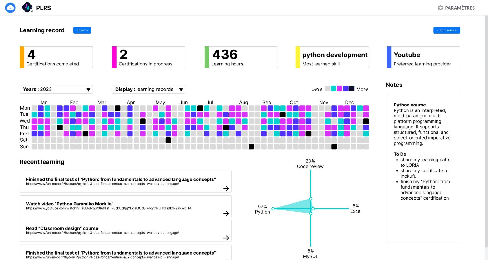

# PLRS Design Document

Personal Learning Record Store (PLRS) service is a type of cloud-based service that allows individuals to store and manage their own learning records in a central location. A PLRS will allow individuals to easily access, download, and reuse their personal learning data, which is a key aspect of data portability under the GDPR. It also helps the data controller to comply with GDPR regulation. PLRS will allow individuals to keep track of their learning activities, achievements, and progress, and to share this information with others if, or when, they choose to.

While a typical [Learning Record Store (LRS)](https://github.com/adlnet/xAPI-Spec/blob/master/xAPI-About.md#part-one-about-the-experience-api) is owned by the organizations providing the training to the learner, a PLRS is owned directly by the learner itself.

A personal LRS can be considered as a "personal cloud" service, as it allows individuals to store and access their learning records from any device with internet access. It also provides a level of control, security and privacy as the data is owned and controlled by the individual. Personal LRS can also allow for greater interoperability with other systems or applications by providing a standardized way of storing and sharing learning records.




## Technical usage scenarios & Features

*See "[BB info for use cases (WP2)](https://docs.google.com/spreadsheets/d/1oKWCe0XqRJ1d-wZfKnFtZb2fS0NetFMEXX4OWSyiwDU/edit#gid=1137874968)" spreadsheet.*

**Key functionalities:**

- export learning traces from LMS to PLRS (in LMS frontend)

- import learning traces from LMS to PLRS (in PLRS frontend)

- visualize learning traces in PLRS

- synchronize PLRS data with external LRS

- local access to data for edge computing

**Value-added:**

- lifelong availability of my learning data

- better learning path/career analysis

- edge computing

### Features/main functionalities

**Features**: 

- **Export learning traces from LMS to PLRS (in LMS frontend)** 
Depending on the LMS, a gateway will be created. It can take the form of a button. When users click on it, they send their personal data to the PLRS. 
Knowing that the PLRS only accepts xAPI format, if the data from the LMS does not have this format, the first call will be made to the LRC. Path: 
    - "learner completes an activity on an LMS "
    - "its learning records are stored in the associated LRS"
    - "learning records are exported to PLRS by clicking a button"
    - "BB Consent checked for learner consent"
    - "BB Data veracity assurance ensures data consistency"
    - "LRC converts traces into xAPI"
    - "LRC sends traces to PLRS"
    - "Update of PLRS visual graphs and data"

- **Import learning traces from LMS to PLRS (in PLRS frontend)** 
If the LMS the learner is using doesn't have this direct export to PLRS button, then they can choose to export their dataset from the LMS and then import it into PLRS. Path:
  - "the learner adds a source in the PLRS: import dataset in any format"
  - "BB Consent checked for learner consent"
  - "BB Data veracity assurance ensures data consistency"
  - "LRC converts traces into xAPI"
  - "LRC sends traces to PLRS"
  - "adaptation of PLRS visual graphs and data"

- **Visualize learning traces in PLRS** 
The aim is not to have a complete visualization of learning traces. It just needs to display a limited amount of information in the dashboard, such as: number of traces per day, certification in progress, certification acquired, etc. (tbd). \
For a complete visualization, the PLRS can be connected to another application dedicated to this purpose. Path:
  - "learners can view indicators and graphs linked to their learning traces"

- **Synchronize PLRS data with external LRS** 
Students can permanently (or not) share their learning traces with an external LRS. Whether it's to justify their progress to a school or to their employer, users are in control of their data. These data exchanges are in xAPI format. Path:  
  - "In the PLRS frontend, the learner selects the data he wants to share with the chosen external LRS."
  - "PLRS synchronizes with target LRS"

**- Local access to data for decentralized AI training** 
Users can give local access to their data to train model on them using a decentralized AI training approach.. This makes it possible to run computation on the data locally (within the PLRS) and only return the result. This way learner data do not exit their PLRS and limit privacy issues associated with sharing data externally. Path: 
  - "In the PLRS frontend, learner selects the data he wants to give local access to run an algorithm on it"
  - "PLRS runs locally the computation on the selected data"
  - "PLRS sends the result of the computation back to the edge computing orchestrator"

### Technical usage scenarios

A student can use their Personal Learning Record Store (PLRS) in a variety of ways to track their learning activities and progress. Here is an example of how a student might use their PLRS:

1. Tracking learning activities: The student can use their PLRS to log their learning activities, such as classes, workshops, and self-study sessions. They can also include information about the topics covered and the resources used.

2. Recording achievements: The student can use their PLRS to record achievements such as completing a course, passing an exam, or receiving a certification. This information can be used to demonstrate their learning progress to others.

3. Sharing with others: If desired, the student can share the learning data in their PLRS with others, such as potential employers, educational institutions, or learning coaches. This allows them to demonstrate their learning progress and achievements to others.

4. Keeping a record of the learning journey: The student can use the PLRS to keep a record of their learning journey, which can be useful for planning future learning and career goals.

5. Providing evidence for micro-credentials or badges earned: The student can use the PLRS to store and provide evidence for any micro-credentials or badges earned.

6. Providing data for analytics: The student can use their PLRS to provide data for analytics, such as identifying areas where they need improvement, tracking their progress over time, and measuring the impact of different learning activities.

The PLRS is beneficial for training organizations:

1. Ensure training progress: The student can share his or her credentials and progress on a permanent basis.

2. Detecting trouble spots: Thanks to sharing, the organization will have more learning traces, making it possible to detect learner difficulties, especially those recorded before the student joined the current training organization.

The PLRS is beneficial for future employers:

1. Check skills held: Locally shared traces enable the future employer to ascertain the skills of the individual. This can have a positive impact on the person's employment, as their skills are verified and not just a line on their CV.

2. Don't waste time on profiles that don't match: The future employer can easily detect whether the person's skills are in line with those required for a job. This way, the employer and the individual don't waste time when there's no match.

## Requirements

*See the **[Requirements spreadsheets](https://docs.google.com/spreadsheets/d/1_woXk9aom9tDLeOff_G2cQngiwdFP7_AS2Kw-h55kgs/edit#gid=1026755951)*

| Requirement ID | Short description | BB input format | BB output format | Any other constraints | Verified by scenario | Requirement type |
|---|---|---|---|---|---|---|
| BB-REQ_ID__1 | PLRS must request building block consent via the ARIANE connector | API call | API response |  |  |  |
| BB-REQ_ID__1.1 | Individuals must consent to the use of their data in LOMCT | API call | API response | If the answer is no, the data cannot be used, nor transferred into or from the PLRS.
If the answer is yer, the data can be used, and transferred into or from the PLRS. | BB-SC-PLRS-01 | DEP |
| BB-REQ_ID__1.2 | Consent must be asked and verified in less than 30s | API call | API response |  | BB-SC-PLRS-02 | PERF |
| BB-REQ_ID__2 | PLRS must request contracts from the building block consent via the ARIANE connector | API call | API response |  |  |  |
| BB-REQ_ID__2.1 | The PLRS must check with the contract manager through the Dataspace connector if a contract for the corresponding organization exists | API call | API response | If the answer is no, the data cannot be accessed, nor transferred into or from the PLRS.
If the answer is yer, the data can be accessed, and transferred into or from the PLRS. | BB-SC-PLRS-03 | DEP |
| BB-REQ_ID__2.2 | Contract must be asked and verified in less than 30s | API call | API response |  | BB-SC-PLRS-04 | PERF |
| BB-REQ_ID__3 | PLRS must connect with BB Consent/contracts negotiating agent (EDGE-Skill) |  |  |  |  |  |
| BB-REQ_ID__3.1 | BB must send the individual's consent profile when the PLRS asks to adjust what and when they are tracked: all-time connection, only on weekends, certain keywords, etc. | API call | consent profile | Request consent 1 time, then update if the profile is modified in the corresponding building bloc
Could be asynchronous | BB-SC-PLRS-05 | DEP |
| BB-REQ_ID__3.2 | BB must update the individual's consent profile to PLRS when there are changes | consent profile | / | update if the profile is modified in the corresponding building bloc
Could be asynchronous | BB-SC-PLRS-06 | DEP |
| BB-REQ_ID__4 | PLRS should connect with BB Data veracity assurance (EDGE-Skill) | API call | API response |  |  |  |
| BB-REQ_ID__4.1 | BB Data veracity assurance should check dataset homogeneity and detail | xAPI (DASES) dataset | response |  | BB-SC-PLRS-07 | FUN |
| BB-REQ_ID__5 | PLRS should connect with BB Decentralized AI training (EDGE-Skill) |  |  |  |  |  |
| BB-REQ_ID__5.1 | PLRS should be able to run algorithm shared by BB Decentralized AI training, locally on the data in the PLRS | API interaction | API interaction | Data transfer via xAPI
Could be asynchronous | BB-SC-PLRS-08 | FUN |
| BB-REQ_ID__5.2 | Running the algorithm must be done in less than 2 min | API call | API response |  | BB-SC-PLRS-09 | PERF |

## Integrations

### Direct Integrations with Other BBs

**Interact with Decentralized AI training**

How?

- send anonymized (or not) data to train AI models

Why?

- train AI model

**Interact with Data veracity assurance**

How?

- Send access to dataset

Why?

- Ensure that data exploitation is feasible

- Ensure data consistency

**Interact with consent/contract**

How?

- Identify data import period (date, time, week)

- Identify data export period (date, time, week, organization)

Why?

- Transparency on data transfer

**Interact with ****Distributed data visualization**

How?

- Send dataset in xAPI format

- Asynchronous

Why?

- Visualize the learner's skills

### Integrations via Connector

**Connection with connector**

Why?

- Simplify communication between the PLRS and PTX CCs

**Connection with contract**

Why?

- Contract between PTX and the LMS authorizing export of user data

What?

- Obtain the organization's agreement to export user data.

- Identify the data standard to be transferred.

**Connection with consent**

Why?

- User consent to export/import his data

What?

- Obtain the user's consent to export data

- Obtain consent to import data

- Obtain person's agreement to share data with selected organizations/persons

- Obtain the person's agreement to use his data to improve AI

- Obtain consent to analyze data

**Connection with identity**

Why?

- Enable PLRS to use users' identities to display metadata with other

What?

- Use the user's first and last name

- Use the user's professional background

- Use the user's educational background

**Connection with LRC**

Why?

- Harmonize data in the PLRS in xAPI

What?

- Convert any dataset to xAPI format

## Relevant Standards

### Data Format Standards

**Data format**

- The data produced and/or consumed are learning records. These are logs of learning activity done by a user.

- There are several standard formats for learning records (SCORM, xAPI, cmi5, IMS caliper).

- The consensus among experts is that xAPI is the most promising standard for describing learning records.

- Inokufu have published on Prometheus-X's github a state of the art study about learning records interoperability in 2023 (see [here](https://github.com/Prometheus-X-association/learning-records-interoperability-2023)). This study describes the various formats and explains why “we" have selected xAPI as the defacto format for learning records for DASES (Dataspace of Education & Skills).

- In xAPI, each learning record is a json statement. This json contains several parts: actor, verb, object, result, context, timestamp.

- The most critical personal data are in general in the actor part. According to xAPI, one can use first name, last name or email as the actor identifier. However, in our case we always recommend using uuid to identify actors. This way our learning records are pseudonymized by default. As this won’t always be the case with other organizations connected to the dataspace.

- If shared datasets are not in xAPI format, LRC must be used to convert them to the correct format.

### Mapping to Data Space Reference Architecture Models


## Input / Output Data

Input and output data are in the same format: xAPI.

[Example](https://drive.google.com/drive/folders/1vAjDc_iEsTRBenDVABmYEvztBh1OE_St): 

```json
{
  "stored": "2024-03-11T14:17:43.686Z",
  "priority": "MEDIUM",
  "active": true,
  "completedForwardingQueue": [],
  "failedForwardingLog": [],
  "client": "626a34fe1deb08f53ac12609",
  "lrs_id": "626a34fe1deb08d43dc12608",
  "completedQueues": [
    "STATEMENT_QUERYBUILDERCACHE_QUEUE",
    "STATEMENT_PERSON_QUEUE",
    "STATEMENT_FORWARDING_QUEUE"
  ],
  "activities": [
    "https://becomino.com/category/competences-bureautiques"
  ],
  "hash": "2b898680c9870ee54d8d260b75eb45d38fbb6c24",
  "agents": [
    "https://becomino.com/users|1710166580617x845375926584167200"
  ],
  "statement": {
    "authority": {
      "objectType": "Agent",
      "name": "Becomino",
      "mbox": "mailto:contact@becomino.com"
    },
    "stored": "2024-03-11T14:17:43.686Z",
    "context": {
      "contextActivities": {
        "parent": [
          {
            "id": "https://becomino.com/home",
            "objectType": "Activity"
          }
        ],
        "category": [
          {
            "id": "https://becomino.com/category/404",
            "objectType": "Activity"
          }
        ],
        "grouping": [
          {
            "id": "https://becomino.com/board/404",
            "objectType": "Activity"
          }
        ]
      },
      "language": "fr"
    },
    "actor": {
      "account": {
        "homePage": "https://becomino.com/users",
        "name": "1710166580617x845375926584167200"
      },
      "objectType": "Agent"
    },
    "timestamp": "2024-03-11T14:17:32.814Z",
    "version": "1.0.0",
    "id": "8f5e30f6-312e-4ec6-bc60-a37bcb1811ec",
    "verb": {
      "id": "https://w3id.org/xapi/netc/verbs/accessed",
      "display": {
        "en-US": "accessed"
      }
    },
    "object": {
      "id": "https://becomino.com/category/competences-bureautiques",
      "definition": {
        "name": {
          "fr": "Compétences bureautiques"
        },
        "description": {
          "fr": ""
        },
        "type": "http://adlnet.gov/expapi/activities/link"
      },
      "objectType": "Activity"
    }
  },
  "hasGeneratedId": true,
  "deadForwardingQueue": [],
  "voided": false,
  "verbs": [
    "https://w3id.org/xapi/netc/verbs/accessed"
  ],
  "personaIdentifier": "65ef1288fff35065a8f02d8c",
  "processingQueues": [],
  "person": {
    "_id": "65ef128899ffae0133166652",
    "display": "1710166580617x845375926584167200 - https://becomino.com/users (xAPI Account)"
  },
  "timestamp": "2024-03-11T14:17:32.814Z",
  "relatedActivities": [
    "https://becomino.com/category/competences-bureautiques",
    "https://becomino.com/home",
    "https://becomino.com/board/404",
    "https://becomino.com/category/404"
  ],
  "relatedAgents": [
    "https://becomino.com/users|1710166580617x845375926584167200",
    "mailto:contact@becomino.com"
  ],
  "organisation": "626a340cccbcc9000aff1421",
  "_id": "65ef1287c56582001cca4966",
  "registrations": [],
  "pendingForwardingQueue": []
}
```

## Architecture


## Dynamic Behaviour

Behavior when exporting a dataset from the LMS :


Behavior when importing a dataset from the PLRS :


Behavior when share a dataset from the PLRS :


## Configuration and deployment settings

Deployment & installation

- The user must have created its Cozy cloud and installed it on its device (see [here](https://cozy.io/en/download/))

- Once installed, the user must go to cozy app store and select the PLRS app

## Third Party Components & Licenses

*See the "**[EDGE third party/background components](https://docs.google.com/spreadsheets/d/13Lf4PfVnA_lAk-7dMeIy0QRxHnarxMcsS8EaLjyOlBA/edit#gid=1385858520)**" spreadsheet.*

External components and licenses:

- Cozy cloud, [open source](https://github.com/cozy/cozy-stack), [license ](https://github.com/cozy/cozy-stack?tab=AGPL-3.0-1-ov-file#readme)[GPLv3](https://github.com/cozy/cozy-stack?tab=AGPL-3.0-1-ov-file#readme)

## Implementation Details

*This is optional: remove this heading if not needed.*

*You can add details about implementation plans and lower-level design here.*

## OpenAPI Specification

*In the future: link your OpenAPI spec here.*

```yml
openapi: 3.0.0 \
info: \
     version: 0.0.1 \
     title: Personal Learning Record Store \
   description: Personal Learning Record Store (LRS) allows individuals to store and manage their own learning records in their cloud drive. PLRS allows individuals to keep track of their learning activities, achievements, and progress through their whole life. They can easily share these data with others if, or when, they choose to. \
paths: \
     /list: \
          get: \
               description: Returns a list of stuff \
                    responses: \
                         '200': \
                              description: Successful response
```

## Test specification

*Test definitions and testing environment should be availaible, and the tests should be repeatable.*

### Test plan

*Testing strategy, tools and methods chosen, methods for acceptance criteria.*

*To be detailed.*

### Unit tests

*Here specify the test cases for the components inside the BB.*  

*Candidates for tools that can be used to implement the test cases: JUnit, Mockito, Pytest.*

### Integration tests

*Here specify how to test the integration of the components inside the BB.*

*Candidates for tools that can be used to implement the test cases: K6, Postman, stepci, Pact*

*An example tutorial is available [here](https://github.com/ftsrg-edu/swsv-labs/wiki/2b-Integration-testing).*

### UI test (where relevant)

*Candidates for tools that can be used to implement the test cases: Selenium* 


